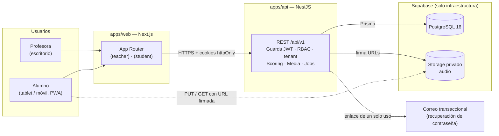
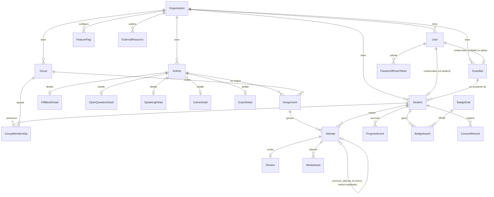
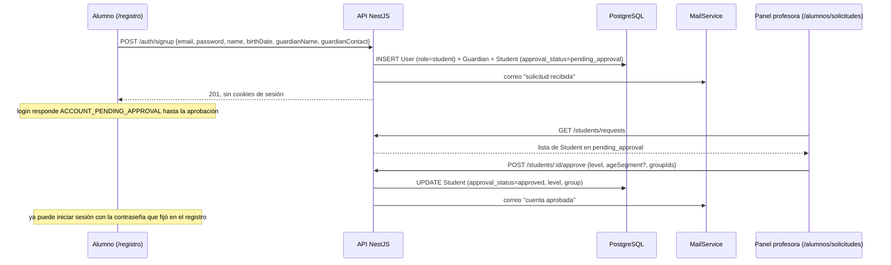
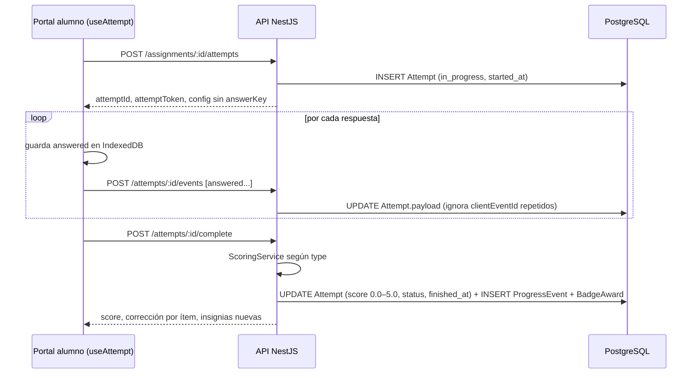
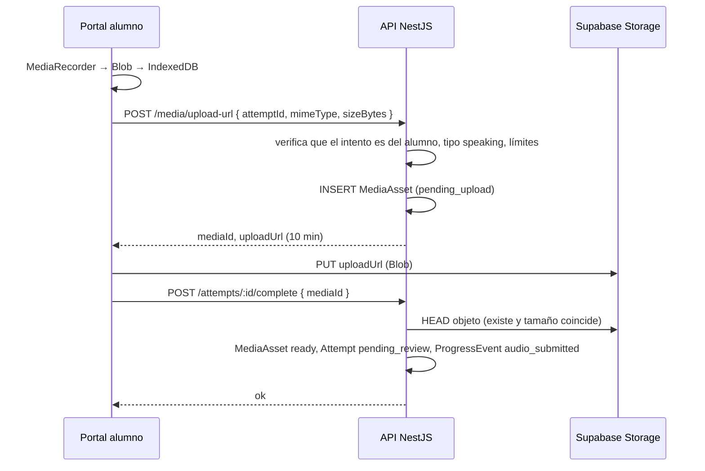

# Englove — Architecture Overview

> **Propósito.** Vista técnica de cómo se construye Englove: piezas, fronteras, flujos y reglas de implementación. Desarrolla lo que `.agents/CONTEXT.md` fija en §4, §6, §7, §10 y §11. Ante cualquier conflicto, manda `CONTEXT.md`.
>
> Estados usados en este documento:
> - **Decidido**: proviene de `CONTEXT.md` o fue aceptado en su §14. No se cambia sin nueva entrada allí.
> - **Propuesto**: detalle de implementación que este documento añade y aún no se ha confirmado (lista en §14).
> - **Pendiente**: requiere decisión humana.
>
> Documentos hermanos: [`sdd-process.md`](./sdd-process.md) (metodología), [`pbp-development.md`](./pbp-development.md) (etapas de construcción) y [`taskboard.md`](./taskboard.md) (tareas y estado). Las specs de `specs/` detallan cada capacidad a partir de este documento.
>
> Última actualización: 2026-09-21. Las propuestas A1–A15 fueron aceptadas en su totalidad (CONTEXT §14, decisión 20) y pasan a Decidido en el cuerpo del documento.

---

## Índice

1. Vista general
2. Estructura del monorepo
3. Frontend (`apps/web`)
4. Backend (`apps/api`)
5. Paquete compartido y contrato de actividad
6. Modelo de datos
7. Flujos clave
8. Multi-tenant y seguridad
9. Gamificación y estadísticas
10. Offline, PWA y accesibilidad
11. Entornos, CI/CD y despliegue
12. Observabilidad y calidad
13. Convenciones de código y API
14. Decisiones añadidas por este documento
15. Preguntas abiertas de arquitectura

---

## 1. Vista general

Englove es una aplicación web con dos superficies (panel de la profesora y portal del alumno) servidas por una misma app Next.js, una API NestJS que concentra toda la lógica de negocio, y Supabase usado únicamente como PostgreSQL y almacenamiento de archivos.



Despliegue (Decidido, CONTEXT §6): `apps/web` en **Vercel**, `apps/api` en **Render**, ambos bajo el mismo dominio raíz (§11).

**Principios que gobiernan el diseño (Decidido, CONTEXT §7.1):**

1. NestJS es el único backend de negocio. El frontend nunca habla con Postgres ni decide autorización.
2. Multi-tenant desde el esquema: `organization_id` en toda tabla de tenant, aunque el piloto tenga una sola organización.
3. `Activity` → `Assignment` → `Attempt` es el eje de todo flujo de aprendizaje.
4. Tabla base + tabla de detalle 1:1 por tipo de actividad.
5. Progreso como eventos append-only (`ProgressEvent`).
6. Puntaje calculado en servidor.
7. Feature flags por organización en base de datos.

**Lo que esta arquitectura no incluye en el piloto (Decidido, CONTEXT §2.4):** WebSockets, heartbeat, pantallas de `parent` y `admin`, Capacitor, muro social, Phaser, iframes de Educaplay, pagos, firma digital. Si una tarea parece necesitarlos, se detiene y se propone en CONTEXT §14.

---

## 2. Estructura del monorepo — Decidido (A1)

Herramientas: pnpm workspaces + Turborepo. Justificación: caché de builds y ejecución de tareas por paquete con configuración mínima, sin generadores de código ni capas adicionales.

```
englove/
├── .agents/CONTEXT.md          # fuente de verdad de producto y decisiones
├── planning/                   # este documento, proceso SDD, etapas, taskboard
├── specs/                      # especificaciones por capacidad (SPEC-01 … SPEC-10), ver sdd-process.md
├── apps/
│   ├── web/                    # Next.js: panel profesora + portal alumno + PWA
│   └── api/                    # NestJS: API REST, scoring, media, jobs programados
├── packages/
│   └── shared/                 # enums, esquemas Zod por tipo de actividad, contrato de actividad, tipos de API
├── tooling/                    # tsconfig, eslint y prettier compartidos
├── docker-compose.yml          # Postgres 16 local
├── pnpm-workspace.yaml
├── turbo.json
└── package.json
```

Reglas de dependencia:

- `apps/web` → `packages/shared`.
- `apps/api` → `packages/shared`.
- `packages/shared` no importa nada de `apps/*` ni de Prisma. Es TypeScript puro + Zod.
- No existe `packages/ui`. Los tokens y componentes viven en `apps/web` hasta que aparezca una segunda aplicación que los necesite. Capacitor (Fase 2) empaqueta la misma web, así que probablemente nunca haga falta.

---

## 3. Frontend (`apps/web`)

### 3.1 Estructura de rutas — Decidido

```
apps/web/src/app/
├── (public)/
│   ├── login/                  # profesora y alumno: correo + contraseña (la API resuelve el rol)
│   ├── registro/               # auto-registro del alumno: crea cuenta en pending_approval
│   ├── recuperar-contrasena/   # solicitar enlace de recuperación
│   └── restablecer/[token]/    # nueva contraseña con enlace de un solo uso
├── (teacher)/
│   ├── layout.tsx              # tema neutro, navegación lateral
│   ├── actividades/            # gestor de contenidos
│   ├── asignaciones/
│   ├── revision/               # calificación y feedback: cola manual + intentos autocalificados + habilitar nuevo intento
│   ├── alumnos/                # solicitudes de registro, alumnos, acudientes, consentimiento, restablecer contraseña
│   ├── grupos/
│   ├── estadisticas/           # rendimiento y constancia por alumno y grupo + leaderboard privado
│   └── contenido-extra/
└── (student)/
    ├── layout.tsx              # fija data-theme según age_segment
    ├── inicio/                 # asignaciones abiertas
    ├── actividad/[attemptId]/  # renderizador
    ├── juegos/                 # lista → juego
    ├── progreso/               # resumen → insignias / rachas
    ├── feedback/               # lista → detalle por actividad
    └── extra/                  # contenido extra (flag extra_content)
```

`middleware.ts` de Next solo comprueba la presencia de la cookie de sesión y el rol para redirigir entre grupos de rutas. La autorización real la aplica la API en cada petición.

**Regla de navegación (Decidido, CONTEXT §5.2 y §14 decisión 29): entre 2 y 4 clics según la zona**, contando desde `inicio` y sin contar el login. Cada zona tiene un techo propio y la spec de la Etapa 5 lo verifica pantalla por pantalla:

| Zona | Destino final | Clics máximos | Ruta típica |
|---|---|---|---|
| Actividades asignadas | Empezar una actividad | **2** | `inicio` → tarjeta de asignación → renderizador |
| Juegos | Empezar un microjuego | **3** | `inicio` → `juegos` → juego |
| Progreso | Detalle de una insignia o de la racha | **3** | `inicio` → `progreso` → insignia |
| Feedback | Leer el comentario de la profesora sobre un intento | **3–4** | `inicio` → `feedback` → actividad → intento (si hubo más de uno) |
| Contenido extra | Abrir un enlace externo | **3** | `inicio` → `extra` → enlace |

Principios que mantienen la simpleza dentro del rango: la barra de navegación del alumno siempre visible con como máximo cinco entradas; sin menús anidados; ninguna pantalla intermedia que solo contenga un botón; el botón "volver" siempre lleva a la pantalla anterior de la misma zona.

### 3.2 Datos y estado — Decidido (A2)

- TanStack Query para todo acceso a la API: caché, reintentos, y `refetchInterval: 30_000` en estadísticas y cola de revisión (el "polling cada 30 s" de CONTEXT §2.4).
- Sin gestor de estado global adicional. El estado de una actividad en curso vive en el hook `useAttempt` y en la cola offline (§10).
- Formularios del panel con react-hook-form y resolvers de Zod, reutilizando los esquemas de `packages/shared`. El formulario de cada tipo de actividad se deriva de su esquema: un cambio en el esquema, un cambio en el formulario.

### 3.3 Sistema de diseño y temas — Decidido (CONTEXT §8 y decisión 20)

- Un solo conjunto de tokens con dos valores: `[data-theme="kids"]` y `[data-theme="teens"]` como CSS variables (`--color-*`, `--font-*`, `--space-*`, `--radius-*`, `--motion-*`, `--sound-*`). Tailwind los consume vía `theme.extend`.
- Los componentes del alumno se construyen una sola vez y leen el conjunto activo. Solo hay variantes estructurales donde la diferencia lo exige: layout de la zona de juegos y densidad de la home.
- El panel de la profesora usa shadcn/ui con un tema neutro y no participa del sistema Kids/Teens.
- Framer Motion sin restricción (Decidido). Las variantes de animación viven en `motion/kids.ts` y `motion/teens.ts` y se cargan con `next/dynamic` según el tema activo: cada audiencia descarga solo su bundle.
- Howler.js para efectos de sonido (activados por defecto en Kids, configurables en Teens) y canvas-confetti en celebraciones.

### 3.4 Renderizador de actividades

`ActivityRenderer` recibe `{ type, config, attemptToken }` y monta el componente del tipo correspondiente. Todos los componentes de actividad, fichas y microjuegos por igual, consumen `useAttempt()`, que implementa el contrato de actividad (§5): emite `started`, `answered` y `completed`, encola offline y reintenta. Ningún componente de actividad llama a la API directamente.

### 3.5 Speaking en el navegador

`MediaRecorder` graba en `audio/webm;codecs=opus` (Chrome, Android) o `audio/mp4` (Safari, iOS). El blob se guarda en IndexedDB antes de intentar la subida; si la subida falla, el intento queda "pendiente de envío" y se reintenta (§10). El servidor guarda el archivo tal cual con su `mime_type`.

Riesgo conocido: la reproducción de WebM/Opus en Safari de escritorio es irregular. Mitigación: recomendar Chrome o Edge en el panel de la profesora; evaluar transcodificación en Fase 2 si aparece la necesidad.

---

## 4. Backend (`apps/api`)

### 4.1 Módulos planos — Decidido (CONTEXT §6 y decisión 20)

Cada módulo es `controller` → `service` → Prisma. Sin repositorios genéricos, sin CQRS, sin eventos de dominio en el piloto.

| Módulo | Responsabilidad | Endpoints principales |
|---|---|---|
| `auth` | login con correo y contraseña (todos los roles), auto-registro del alumno, refresh rotativo, logout, recuperación de contraseña, bloqueo por intentos | `POST /auth/login`, `POST /auth/signup`, `POST /auth/refresh`, `POST /auth/logout`, `POST /auth/forgot-password`, `POST /auth/reset-password` |
| `guardians` | acudientes y aceptación de T&C | `GET/POST/PATCH /guardians` |
| `students` | alumnos, nivel, segmento, consentimiento, aprobación de solicitudes, restablecer contraseña, borrado en cascada | `GET/POST/PATCH/DELETE /students`, `GET /students/requests`, `POST /students/:id/approve`, `POST /students/:id/reject`, `POST /students/:id/consent`, `POST /students/:id/reset-password` |
| `groups` | grupos y membresías | `/groups`, `/groups/:id/members` |
| `activities` | CRUD de actividades y detalle por tipo, estados, versionado | `/activities`, `POST /activities/:id/publish`, `POST /activities/:id/duplicate` |
| `assignments` | asignación a grupos con fechas | `/assignments`, `GET /me/assignments` |
| `attempts` | ciclo start / events / complete, scoring, control de un intento por asignación | `POST /assignments/:id/attempts`, `POST /attempts/:id/events`, `POST /attempts/:id/complete` |
| `reviews` | cola de revisión, calificación 0,0–5,0, feedback, habilitar nuevo intento | `GET /reviews/queue`, `GET /reviews/graded`, `POST /attempts/:id/review`, `POST /attempts/:id/grant-retry` |
| `progress` | `ProgressEvent`, insignias, rachas | `GET /me/progress`, `GET /students/:id/progress` |
| `stats` | rendimiento y constancia por alumno y grupo; leaderboard privado | `GET /stats/students/:id`, `GET /stats/groups/:id`, `GET /stats/overview`, `GET /stats/leaderboard` |
| `media` | URLs firmadas, `MediaAsset`, retención | `POST /media/upload-url`, `GET /media/:id/url` |
| `resources` | contenido extra (enlaces externos) | `/resources` |
| `feature-flags` | flags por organización | `GET /feature-flags` |
| `health` | liveness y conexión a base de datos | `GET /health` |

### 4.2 Validación en dos niveles — Decidido (A5)

CONTEXT pide DTOs con `class-validator` en todos los endpoints (§6) y esquemas Zod compartidos por tipo de actividad (§6, Repositorio). Conviven así:

- **class-validator** valida la forma de cada petición: campos obligatorios, tipos, longitudes, enums.
- **Zod** (desde `packages/shared`) valida el contenido específico de un tipo de actividad: el campo `config` al crear o editar una actividad, y el campo `answers` al enviar respuestas. Se aplica con un `ZodValidationPipe` que selecciona el esquema según `activity.type`.

Regla: nada específico de un tipo de actividad se valida con class-validator; nada de la envoltura HTTP se valida con Zod.

### 4.3 Guards y contexto de tenant — Decidido (A4)

Orden de ejecución: `JwtAuthGuard` → `RolesGuard` → `TenantContext`.

- El JWT contiene `sub` (user id), `role`, `org` (organization_id), `sid` (familia de sesión) y, para alumnos, `student_id` y `age_segment`. El login es el mismo endpoint para todos los roles; el rol sale de `User.role`, nunca del cliente.
- `TenantContext` expone `organization_id` durante toda la petición mediante AsyncLocalStorage.
- Una extensión de Prisma Client añade `where: { organization_id }` a todas las operaciones sobre modelos de tenant. Los servicios además filtran explícitamente. El doble filtro es deliberado: defensa en profundidad para el multi-tenant real de Fase 2.
- Un test de esquema verifica que toda tabla marcada como tenant tiene `organization_id`.

### 4.4 Scoring — Decidido (en servidor, A15; escala 0,0–5,0 por decisión 24)

`ScoringService` delega en una estrategia por tipo. Cada scorer produce una **fracción de acierto** entre 0 y 1; `ScoringService` la convierte a la **escala colombiana 0,0–5,0** con un decimal (`round(fraction × 5, 1)`) y la guarda en `Attempt.score`. Ningún scorer ni cliente escribe directamente en la escala.

| Tipo | Scorer (fracción de acierto) | Resultado |
|---|---|---|
| `fill_blank` | ítems correctos / ítems totales, comparando `answers` con `answerKey` | `graded`, corrección por ítem |
| `exam` | media ponderada de sus ítems; cada ítem reutiliza el scorer de su subtipo; pesos en `ExamDetail` | `graded` |
| `game` | por mecánica: aciertos, errores y tiempo según fórmula del esquema de la mecánica; valida duración plausible | `graded` |
| `open_question` | ninguno; la profesora introduce el `score` 0,0–5,0 en la revisión | `pending_review` |
| `speaking` | ninguno; la profesora introduce el `score` 0,0–5,0 en la revisión | `pending_review` |

Reglas de la escala:

- `Attempt.score` y `Review.score` son `numeric(2,1)` entre `0.0` y `5.0`. La API rechaza cualquier otro valor con `SCORE_OUT_OF_RANGE`.
- Umbral de aprobación `3.0` (Decidido), leído de `FeatureFlag`/configuración de la organización como `passing_score`. Determina el estado visual "aprobado / por mejorar" en el portal y en el panel; no bloquea nada.
- La interfaz muestra la coma decimal (`4,5`); la API y la base de datos usan punto (`4.5`).
- Las estrellas del alumno se derivan del `score`: 0–1 estrellas por debajo del umbral, 2 estrellas entre el umbral y 4,4, 3 estrellas de 4,5 en adelante (Decidido, A16).

Validación de plausibilidad: si `finished_at - started_at` es menor que un mínimo por tipo (por ejemplo, 3 s por ítem), el intento se califica igual pero se marca con `flags: ['implausible_duration']` para que la profesora lo vea. No se rechaza: un niño que responde rápido no debe perder su trabajo. Los umbrales viven en la configuración de la actividad con valores por defecto.

### 4.5 Tareas programadas — Decidido (decisiones 20, 27 y 32)

Con `@nestjs/schedule`:

- Nocturna: marcar `abandoned` los intentos `in_progress` cuya asignación ya cerró.
- Nocturna, **retención de audios** (Decidido, CONTEXT §9 y decisión 27): borrar del bucket los `MediaAsset` con `retention_until < now()`; borrar los `MediaAsset` en `pending_upload` creados hace más de `pending_upload_ttl_days`; reintentar los `pending_delete` que fallaron. Al borrar, el registro pasa a `deleted` y conserva `attempt_id`, `mime_type` y `deleted_at` para trazabilidad; `Review` y `Attempt.score` no se tocan. Plazos (Decidido): `retention_days = 30` tras la calificación y `pending_upload_ttl_days = 7`, ambos configurables por organización.
- Nocturna: desbloquear cuentas cuyo bloqueo por intentos fallidos ya venció (limpieza; el desbloqueo real es por comparación de `locked_until` en el login).
- Semanal (lunes 00:05 America/Bogota): recalcular rachas y emitir `streak_week` (§9.3).

### 4.6 Configuración y logging

- `@nestjs/config` con esquema de validación de variables de entorno. El proceso no arranca si falta un secreto.
- Logging JSON con `nestjs-pino`: `request_id`, `user_id`, `role`, `organization_id`, ruta, latencia, resultado. Nunca cuerpos de petición, contenido de respuestas abiertas, contraseñas, tokens de recuperación ni rutas de audio.

---

## 5. Paquete compartido y contrato de actividad

### 5.1 Contenido de `packages/shared` — Decidido (decisión 20)

```
packages/shared/src/
├── enums.ts                # Role, Level, AgeSegment, ActivityType, GameMechanic, AttemptStatus, ConsentStatus...
├── contract.ts             # ActivityEvent, ActivityRuntimeProps, AttemptResult
├── activities/
│   ├── fill-blank.ts       # configSchema, answerKeySchema, answersSchema
│   ├── open-question.ts
│   ├── speaking.ts
│   ├── game.ts             # unión discriminada por mecánica
│   ├── exam.ts
│   └── registry.ts         # ActivityType → esquemas + toPublicConfig()
└── api/                    # tipos de respuesta compartidos entre web y api
```

### 5.2 Contrato de actividad (Decidido en CONTEXT §7.3)

```ts
export type ActivityEvent =
  | { type: 'started'; at: string }
  | { type: 'answered'; at: string; itemId: string; answer: unknown; clientEventId: string }
  | { type: 'completed'; at: string };

export interface ActivityRuntimeProps<TConfig> {
  attemptToken: string;
  config: TConfig;                        // validado por el esquema Zod del tipo
  onEvent: (event: ActivityEvent) => void;
}
```

- **Entrada:** `config` validado por su esquema Zod + `attemptToken`.
- **Salida:** eventos `started`, `answered`, `completed` hacia la API a través de `useAttempt`.
- El backend valida, califica y persiste `Attempt` y los `ProgressEvent` correspondientes.
- Phaser (Fase 2) implementa `ActivityRuntimeProps` como un componente más. Nada cambia en la API ni en el panel de la profesora.

### 5.3 Regla de la clave de respuestas — Decidido (A6)

El puntaje en servidor solo protege si la clave no viaja al cliente.

- Tipos calificados (`fill_blank`, `exam`): `registry.toPublicConfig()` elimina `answerKey` antes de responder al alumno. La corrección por ítem se devuelve en la respuesta de `complete`, no antes.
- Microjuegos (`game`): la mecánica necesita la clave para dar feedback inmediato (por ejemplo, saber si dos tarjetas emparejan). Se acepta que la clave viaje: son actividades de práctica de bajo riesgo, y el servidor recalcula el puntaje y valida duraciones.
- `speaking` y `open_question` no tienen clave.

### 5.4 Añadir un tipo de actividad (Decidido en CONTEXT §16)

Tres piezas, siempre juntas: esquema Zod en `packages/shared/activities`, tabla de detalle 1:1 en `schema.prisma`, componente que implementa el contrato en `apps/web`. Si el tipo es autocalificable, una cuarta: su scorer en `apps/api`.

---

## 6. Modelo de datos

`schema.prisma` será la referencia autoritativa cuando exista (CONTEXT §7.2). Este apartado fija convenciones y relaciones para escribirlo.

### 6.1 Diagrama de relaciones



### 6.2 Convenciones — Decidido (A7 y decisión 20)

- Claves primarias `uuid`. `created_at` y `updated_at` en toda tabla; `timestamptz` en UTC.
- `organization_id` obligatorio en toda tabla de tenant. La única tabla sin él es `Organization`.
- Identificadores en inglés: modelos en `PascalCase`, columnas en `snake_case` mediante `@map`.
- Borrado: `Student` se borra en cascada real (obligación legal, §8.4). `Activity` con intentos no se borra; se archiva (`status = archived`).
- `Attempt.payload` guarda las respuestas crudas como JSON, cada una con su `clientEventId`. No hay tabla de eventos de intento en el piloto.

### 6.3 Enums — Decidido (decisión 20)

| Enum | Valores |
|---|---|
| `Role` | `teacher`, `student`, `parent`, `admin` |
| `Level` | `A1`, `A2`, `B1`, `B2` |
| `AgeSegment` | `kids`, `teens` |
| `ActivityType` | `fill_blank`, `open_question`, `speaking`, `game`, `exam` |
| `ActivityStatus` | `draft`, `published`, `archived` |
| `GameMechanic` | `match`, `order_words`, `drag_drop`, `memory`, `timed_choice` |
| `AttemptStatus` | `in_progress`, `pending_review`, `graded`, `abandoned` |
| `ConsentStatus` | `pending`, `signed_paper`, `signed_digital` (reservado para Fase 2) |
| `ConsentMethod` | `paper`, `digital` |
| `ApprovalStatus` | `pending_approval`, `approved`, `rejected` |
| `RegistrationSource` | `self_registered`, `teacher_created` |
| `ProgressEventType` | `attempt_completed`, `audio_submitted`, `review_received`, `retry_granted`, `streak_week`, `badge_awarded` |
| `MediaAssetStatus` | `pending_upload`, `ready`, `pending_delete`, `deleted` |

### 6.4 Campos que merecen nota

- `User`: `email` **obligatorio y único por organización** para todos los roles (Decidido, decisión 22), `password_hash` (argon2id), `role`, `organization_id`, `failed_login_count`, `locked_until`. `Student.user_id` es 1:1 obligatorio; `Guardian.user_id` es nullable hasta Fase 2. Desaparecen `pin_hash` y `Student.email`: el correo de acceso del alumno vive en `User.email`.
- `PasswordResetToken`: `user_id`, `kind` (`welcome` 72 h / `reset` 30 min), `token_hash`, `expires_at`, `used_at`. Se guarda el hash, nunca el token; un token usado o caducado no se reutiliza.
- `Student.approval_status` (Decidido, decisión 33): `pending_approval` al auto-registrarse; `approved` tras la revisión de la profesora; `rejected` es transitorio, se resuelve borrando la fila (§8.4). `Student.registration_source` distingue `self_registered` de `teacher_created`, solo para trazabilidad; no cambia ningún otro comportamiento una vez `approved`. `Student.level` y la membresía de grupo son `null` mientras está `pending_approval`.
- `Guardian` creado por auto-registro no tiene `user_id` (no tiene cuenta propia, igual que en el alta directa); solo guarda los datos de contacto capturados en el formulario, editables por la profesora al aprobar.
- `Activity.version` y `parent_id`: una actividad publicada **sin** intentos se edita en sitio; **con** intentos solo se duplica (nueva fila con `version + 1` y `parent_id`) o se archiva. Las asignaciones siguen apuntando a la versión con la que se crearon. Así el historial de calificaciones nunca se reescribe.
- **Un intento por asignación con habilitación por la profesora (Decidido, decisión 25).** No existe `Assignment.max_attempts`. `Attempt` lleva `retry_granted_at`, `retry_granted_by` y `previous_attempt_id`. `POST /assignments/:id/attempts` solo crea un intento si el alumno no tiene ninguno para esa asignación, o si su último intento tiene `retry_granted_at` no nulo y aún no se ha usado. El nuevo intento enlaza al anterior con `previous_attempt_id`. Para estadísticas y progreso cuenta **el último intento calificado**; el historial completo queda visible para la profesora.
- `Attempt.score`: `numeric(2,1)` en escala 0,0–5,0 (§4.4).
- `Attempt.flags`: array de texto para marcas como `implausible_duration` u `offline_sync`.
- `MediaAsset.retention_until`: se fija al calificar como `graded_at + retention_days` (30 por defecto). `MediaAsset.created_at` gobierna el borrado de `pending_upload` (7 días por defecto). Ver §4.5.
- `ConsentRecord`: histórico por alumno. `Student.consent_status` es la proyección del último registro.
- `Group`: sin `classroom_code`. El acceso por código de aula fue descartado (decisión 22).
- `FeatureFlag(organization_id, key, enabled, config json)`: claves iniciales `games`, `extra_content`, `stats`, `leaderboard`; configuración `passing_score`, `retention_days`, `pending_upload_ttl_days`.

### 6.5 Índices iniciales — Decidido (decisión 20)

- `Attempt(assignment_id, student_id, created_at)`; `Attempt(student_id, finished_at)`; índice parcial `Attempt(status) WHERE status = 'pending_review'`.
- `Assignment(group_id, opens_at, due_at)`.
- `ProgressEvent(student_id, occurred_at)`.
- `GroupMembership(group_id, student_id)` único.
- `Activity(organization_id, level, type, status)`.
- `Student(organization_id, approval_status)` para la bandeja de solicitudes.
- `User(organization_id, email)` único.
- `PasswordResetToken(token_hash)` único; `PasswordResetToken(expires_at)` para la limpieza.
- `MediaAsset(status, created_at)` y `MediaAsset(retention_until)` para el job de retención.

---

## 7. Flujos clave

### 7.1 Login y sesión (profesora y alumno) — Decidido (A3, decisiones 22 y 23)

Un único flujo para todos los roles.

1. `POST /auth/login` con correo y contraseña. Hash con argon2id. La respuesta de error es la misma para "correo no existe" y "contraseña incorrecta" (`AUTH_INVALID_CREDENTIALS`).
2. La API responde con dos cookies `HttpOnly; Secure; SameSite=Lax`: `access_token` (15 min, `Path=/`) y `refresh_token` (`Path=/api/v1/auth/refresh`, rotativo) con duración según rol: **30 días profesora, 90 días alumno**. El "Recuérdame" de CONTEXT §4 es implícito para el alumno.
3. El frontend nunca lee los tokens. Al expirar el acceso, llama a `POST /auth/refresh`; la API emite un par nuevo e invalida el anterior.
4. Reutilización de un refresh ya rotado → se revoca toda la familia de sesión (`sid`) y se exige login de nuevo.
5. `POST /auth/logout` revoca la familia y borra las cookies.
6. El frontend redirige según `role` de la respuesta: `(teacher)` o `(student)`.
7. **Cuenta `pending_approval` (Decidido, CONTEXT §4.1 y decisión 33):** si el `Student` de la cuenta tiene `approval_status = pending_approval`, el login responde `403 ACCOUNT_PENDING_APPROVAL` aunque la contraseña sea correcta, sin emitir cookies. Si es `rejected`, responde `AUTH_INVALID_CREDENTIALS` (no se distingue de una cuenta inexistente).

**Bloqueo por intentos fallidos (Decidido, decisión 23):** cada login fallido incrementa `User.failed_login_count`. Al llegar a **10**, se fija `locked_until = now() + 10 min` y todo intento hasta esa hora responde `AUTH_ACCOUNT_LOCKED` con el tiempo restante, sin comprobar la contraseña. Un login correcto pone el contador a cero. El panel de la profesora muestra los alumnos bloqueados y puede desbloquearlos anticipadamente. La misma regla aplica a la profesora, sin desbloqueo anticipado (Decidido).

### 7.2 Auto-registro del estudiante y aprobación por la profesora — Decidido (CONTEXT §4.1 y decisión 33)

Vía principal de alta de un alumno en el piloto.



1. `POST /auth/signup { email, password, name, birthDate, guardianName, guardianContact }`. Sin autenticación previa (endpoint público); `@nestjs/throttler` estricto (10 por hora por IP) para limitar abuso, ya que no requiere invitación ni código.
2. La API valida el correo único por organización (una sola organización en el piloto), aplica los mismos requisitos de contraseña que en recuperación (§7.4) y crea en una transacción: `User` (rol `student`, con la contraseña que el alumno ya fijó), `Guardian` (con los datos de contacto capturados, sin cuenta propia) y `Student` (`approval_status = pending_approval`, `registration_source = self_registered`, `level = null`, sin grupo, `consent_status = pendiente`). `age_segment` se deriva de `birthDate` con el corte de edad de CONTEXT §3.
3. La API responde `201` sin emitir cookies: el alumno no queda dentro de la sesión aunque la cuenta exista. Se envía un correo de "solicitud recibida" (no bloqueante para el flujo).
4. `GET /students/requests` (solo `teacher`) lista los `Student` en `pending_approval` con los datos capturados en el registro.
5. `POST /students/:id/approve { level, ageSegment?, groupIds }`: fija `level` y grupo(s), corrige `age_segment` si la profesora lo considera necesario, y pasa `approval_status` a `approved`. El consentimiento en papel (§9) es un control independiente: puede registrarse antes, durante o después de aprobar la cuenta; la aprobación no lo sustituye ni lo requiere como bloqueante.
6. `POST /students/:id/reject`: borra la solicitud completa (`User`, `Guardian` si no tiene otros alumnos, `Student`) con el mismo mecanismo que el borrado en cascada de §8.4. No hay "correo de rechazo": simplemente la cuenta deja de existir.
7. Al aprobar, `MailService` envía el correo "cuenta aprobada"; el alumno inicia sesión con la contraseña que fijó en el paso 1 (no hace falta restablecerla).

### 7.3 Alta directa por la profesora — Decidido (flujo alterno)

Para alumnos sin correo propio, sin autonomía para completar el formulario, o cuando la profesora prefiere adelantarse: `POST /students` crea `User` + `Student` con `registration_source = teacher_created` y `approval_status = approved` desde el inicio (no pasa por la bandeja de solicitudes). La profesora elige entre dos formas de fijar la contraseña inicial:

- **Correo de bienvenida:** se crea un `PasswordResetToken` de tipo `welcome` (72 h) y se envía un enlace para que el alumno fije su propia contraseña en `app.<dominio>/restablecer/<token>`. La cuenta no puede iniciar sesión hasta ese paso.
- **Contraseña temporal:** la profesora la genera y la entrega en persona (§7.4, paso 5); el alumno debe cambiarla en el primer inicio de sesión.

El resto del ciclo (nivel, grupo, consentimiento) se captura en el mismo formulario de alta, a diferencia del auto-registro donde se completa al aprobar.

### 7.4 Recuperación de contraseña — Decidido (decisiones 22 y 32)

Un único `MailService` sobre Resend, con un solo remitente y dominio verificado, envía todos los correos de cuenta del piloto: solicitud recibida, cuenta aprobada, bienvenida (alta directa) y recuperación de contraseña. Ninguna otra parte del sistema envía correo.

1. `POST /auth/forgot-password { email }`. La API responde siempre `202` con el mismo mensaje exista o no el correo (no revela cuentas). Límite: 3 solicitudes por correo cada 15 minutos.
2. Si existe, crea `PasswordResetToken` (tipo `reset`, token aleatorio de 32 bytes, se guarda su hash, caduca a los **30 minutos**) y envía por correo transaccional un enlace a `app.<dominio>/restablecer/<token>`.
3. `POST /auth/reset-password { token, newPassword }`. Verifica hash, caducidad y no uso; fija la nueva contraseña; marca `used_at`; **revoca todas las familias de sesión** del usuario; responde `200`.
4. Requisitos de contraseña: mínimo 8 caracteres; para alumnos Kids la pantalla sugiere una frase de tres palabras en vez de símbolos. Sin requisitos de complejidad que un niño no pueda recordar. Los mismos requisitos aplican al fijar la contraseña en el auto-registro (§7.2) y en el correo de bienvenida (§7.3).
5. **Restablecimiento por la profesora:** `POST /students/:id/reset-password` genera una contraseña temporal que la profesora comunica en persona; el alumno debe cambiarla en el siguiente inicio de sesión (`User.must_change_password`). Cubre el caso frecuente de alumnos sin acceso al correo, tanto para cuentas creadas directamente como ya aprobadas.
6. `MailService` tiene una única implementación (Resend) con plantillas `signup-received`, `approved`, `welcome` y `password-reset` que comparten remitente, diseño y pie legal; en `local` escribe el enlace o el aviso en el log en vez de enviarlo. `PasswordResetToken.kind` distingue `welcome` de `reset` para aplicar la caducidad correspondiente.

### 7.5 Intento de actividad y puntaje en servidor



Notas:

- **Un intento por asignación (Decidido, decisión 25).** `POST /assignments/:id/attempts` responde `ATTEMPT_ALREADY_EXISTS` si el alumno ya tiene un intento para esa asignación y no tiene un nuevo intento habilitado (§7.7). Si lo tiene, crea el nuevo `Attempt` con `previous_attempt_id` y consume la habilitación.
- El `attemptToken` es un JWT corto con `attempt_id`, `student_id` y expiración en `due_at + 24 h`, para permitir sincronización offline tardía.
- `POST /attempts/:id/events` acepta lotes. Cada `answered` lleva `clientEventId`; los duplicados se ignoran (idempotencia para reintentos offline).
- `complete` calcula el puntaje, fija `finished_at`, emite `ProgressEvent(attempt_completed)` y evalúa insignias en la misma transacción.
- Ningún endpoint acepta `score` desde el cliente (Decidido, CONTEXT §5.3 y §16).

### 7.6 Speaking: grabación, subida y confirmación — Decidido (A9)



- Límite de tamaño por archivo: 10 MB. Duración máxima según `SpeakingDetail.max_duration_sec`.
- Ruta en bucket: `{organization_id}/{student_id}/{attempt_id}/{uuid}.{ext}`. Bucket privado; nadie lista el bucket desde el cliente.
- URL de subida: 10 min. URL de descarga: 5 min, emitida solo tras verificar que quien pide es la profesora de la organización o el propio alumno.
- El audio nunca pasa por la API: va directo del navegador al bucket con la URL firmada.

### 7.7 Calificación, feedback y nuevo intento — Decidido (decisiones 24 y 25)

El área `revision/` del panel tiene dos pestañas sobre el mismo componente de detalle de intento:

- **Pendientes:** `GET /reviews/queue` devuelve intentos `pending_review` (audio o pregunta abierta) con filtros por grupo, tipo y fecha. Polling de 30 s.
- **Calificados:** `GET /reviews/graded` devuelve intentos `graded`, incluidos los autocalificados (fichas, exámenes, microjuegos), con los mismos filtros. Aquí la profesora comenta un intento automático o habilita un nuevo intento.

Flujo de revisión manual:

1. La profesora reproduce el audio (URL firmada) o lee la respuesta, asigna la **calificación 0,0–5,0**, escribe el comentario personal (obligatorio) y elige stickers (opcionales).
2. `POST /attempts/:id/review { score, comment, stickers, allowRetry }` crea `Review`, actualiza `Attempt.status = graded` y `Attempt.score`, emite `ProgressEvent(review_received)` con `value = score` y fija `MediaAsset.retention_until = now() + retention_days`.
3. Si `allowRetry = true`, en la misma transacción se fija `Attempt.retry_granted_at / retry_granted_by` y se emite `ProgressEvent(retry_granted)`.

Habilitar nuevo intento sobre un intento ya calificado (manual o automático): `POST /attempts/:id/grant-retry`. Reglas:

- Solo `teacher`; solo si el intento es el último del alumno para esa asignación y no tiene ya una habilitación sin usar (`RETRY_ALREADY_GRANTED`).
- La habilitación no cambia `due_at`. Si la asignación ya cerró, la profesora puede indicar `extendUntil` (opcional) que se guarda en el `Attempt` habilitado y el nuevo intento lo usa como cierre efectivo.
- El alumno ve en la tarjeta de la actividad "Tu profesora te habilitó un nuevo intento" y puede empezarlo desde `inicio` en 2 clics. El intento anterior y su feedback siguen visibles.
- El nuevo intento pasa por el ciclo completo (§7.5) y, si es de revisión manual, vuelve a la cola. Para estadísticas y progreso cuenta el último intento calificado.

El alumno ve el comentario y los stickers en la vista de esa actividad y en `/feedback`. Sin notificaciones push en el piloto: el feedback aparece al entrar.

### 7.8 Estadísticas con polling — Decidido (A14; foco por decisión 28)

El panel consulta `GET /stats/students/:id`, `GET /stats/groups/:id`, `GET /stats/overview` y `GET /stats/leaderboard` cada 30 s. Todas son lecturas agregadas sobre `Attempt` y `ProgressEvent` con los índices de §6.5. Si alguna supera 500 ms con 100 alumnos, se materializa una vista diaria (`daily_student_activity`) refrescada por el job nocturno. No se introduce caché externa (Redis) en el piloto. El contenido de cada vista se define en §9.4.

---

## 8. Multi-tenant y seguridad

### 8.1 Mapa de controles (CONTEXT §10 → implementación)

| Control (Decidido) | Implementación |
|---|---|
| Refresh tokens rotativos en cookie `httpOnly`; nunca `localStorage` | §7.1; familia de sesión con detección de reutilización; bloqueo 10 intentos / 10 min |
| Cuenta bloqueada hasta aprobación en el auto-registro | §7.2; `ACCOUNT_PENDING_APPROVAL`, sin cookies hasta aprobar |
| Recuperación de contraseña sin revelar cuentas ni tokens | §7.4; respuesta uniforme, hash del token, un solo uso, 30 min, revocación de sesiones |
| URLs firmadas de expiración corta emitidas por el backend | §7.6; verificación de derechos antes de firmar |
| Puntaje y calificación en servidor | §4.4; `score` nunca es campo de entrada de ningún DTO |
| DTOs validados en todos los endpoints | `ValidationPipe` global con `whitelist: true` y `forbidNonWhitelisted: true` + `ZodValidationPipe` |
| RBAC en Guards; `organization_id` en toda consulta | §4.3; extensión de Prisma + filtro explícito + test de esquema |
| Borrado en cascada probado antes de la función | §8.4 |
| Secretos solo en variables de entorno | `.env.example` sin valores; validación al arrancar; secretos del CI en el proveedor |

### 8.2 Cookies, dominios y CORS — Decidido (A13)

Las cookies de sesión requieren que frontend y API compartan dominio registrable: `app.<dominio>` (Vercel) y `api.<dominio>` (Render). Así `SameSite=Lax` funciona y las peticiones `fetch` entre subdominios llevan la cookie. Configuración:

- CORS con allowlist explícita (`https://app.<dominio>`) y `credentials: true`.
- La API rechaza peticiones mutantes cuyo encabezado `Origin` no esté en la allowlist. Es la defensa CSRF adicional a `SameSite=Lax`.
- Plan B si algo falla en el dominio: rewrite de Next.js `/api/*` → API, que deja todo en un solo origen a costa de un salto extra por petición.
- En staging se usa el mismo esquema con `app-staging.` y `api-staging.`; las URLs de vista previa de Vercel (`*.vercel.app`) no comparten dominio con la API y por tanto no tienen sesión: sirven solo para revisar interfaz estática.

### 8.3 Endurecimiento HTTP — Decidido (decisiones 20 y 23)

`helmet`; `@nestjs/throttler` global (100 peticiones por minuto por IP), estricto en `POST /auth/login` (20 por minuto por IP, además del bloqueo por cuenta de 10 intentos / 10 minutos de §7.1), en `POST /auth/signup` (10 por hora por IP, endpoint público sin invitación previa, §7.2) y en `POST /auth/forgot-password` (3 por correo cada 15 minutos); límite de cuerpo JSON de 1 MB (los audios no pasan por la API); `Cache-Control: no-store` en respuestas autenticadas.

### 8.4 Borrado en cascada de un alumno — Decidido (test primero)

`DELETE /students/:id`:

1. Marca los `MediaAsset` del alumno como `pending_delete`.
2. Borra los objetos del bucket.
3. En una transacción borra `Attempt`, `Review`, `ProgressEvent`, `BadgeAward`, `ConsentRecord`, `GroupMembership`, `MediaAsset`, `PasswordResetToken`, `Student` y su `User`.
4. Si el paso 2 falla a mitad, el job nocturno reintenta los `pending_delete` y la transacción del paso 3 no se ejecuta hasta que el bucket quede limpio.

El test de integración se escribe antes que el endpoint y comprueba que no queda ninguna fila ni objeto huérfano.

**Rechazo de una solicitud de auto-registro:** `POST /students/:id/reject` ejecuta el mismo procedimiento sobre un `Student` en `approval_status = pending_approval`. Como nunca tuvo `Attempt`, `Review` ni `MediaAsset`, el borrado es casi siempre inmediato (pasos 3 en adelante). El `Guardian` creado en el registro se borra también si no tiene otros alumnos vinculados.

### 8.5 Datos de menores en logs y errores

Ningún log ni reporte de error incluye nombre, correo, respuesta, audio, contraseña ni token de recuperación. Solo identificadores. La captura de errores del frontend (§12) se configura con envío de datos personales desactivado.

---

## 9. Gamificación y estadísticas

### 9.1 `ProgressEvent` como fuente única (Decidido, CONTEXT §5.4)

Todo lo que el alumno ve (estrellas, insignias, rachas) se deriva de `ProgressEvent`. Nunca se edita un contador. Si cambian las reglas, se recalcula desde los eventos.

Eventos del piloto y quién los emite:

| Evento | Emisor | `value` |
|---|---|---|
| `attempt_completed` | `complete` (tipos autocalificados) | calificación 0,0–5,0 |
| `audio_submitted` | `complete` de speaking | 1 |
| `review_received` | `POST /attempts/:id/review` | calificación 0,0–5,0 |
| `retry_granted` | `review` con `allowRetry` o `grant-retry` | id del intento habilitado |
| `streak_week` | job semanal | número de semanas consecutivas |
| `badge_awarded` | motor de insignias | id de la regla |

Cuando un alumno tiene varios intentos de una misma asignación (nuevo intento habilitado), las agregaciones de rendimiento usan solo el evento del **último intento calificado**; el resto queda en el historial.

### 9.2 Motor de insignias — Decidido (decisión 20)

`BadgeRule` es una fila con `key`, `name`, `description`, `icon`, `rule` (JSON) y `active`. Ejemplos de `rule`:

```json
{ "type": "count", "event": "attempt_completed", "threshold": 1 }
{ "type": "count", "event": "audio_submitted", "threshold": 1 }
{ "type": "streak_weeks", "threshold": 4 }
{ "type": "tenure_years", "threshold": 5 }
```

Se evalúa tras cada `ProgressEvent` nuevo y en el job semanal. Añadir una insignia es insertar una fila, no desplegar código (Decidido: las reglas viven en tabla, no en código).

### 9.3 Rachas semanales y perdonables — Decidido (regla en CONTEXT §5.4; algoritmo A11)

- Semana activa: al menos un `attempt_completed` en la semana ISO, zona America/Bogota.
- La racha cuenta semanas activas consecutivas. Una semana inactiva no rompe la racha si la siguiente vuelve a ser activa; dos seguidas sí la rompen.
- Se calcula en el job semanal y se registra como `streak_week`. Las insignias de 4, 8 y 12 semanas se disparan desde ese evento.

### 9.4 Estadísticas del panel: rendimiento y constancia — Decidido (CONTEXT §13, decisión 28)

La profesora quiere ver **cómo ha avanzado cada estudiante**. No hay métrica global de éxito; las vistas se diseñan directamente sobre dos ejes.

**Vista por estudiante** (`GET /stats/students/:id`):

- *Rendimiento:* serie temporal de calificaciones (0,0–5,0) por intento calificado, con línea del promedio del grupo; promedio por tipo de actividad y por nivel; distribución respecto al umbral de aprobación.
- *Constancia:* calendario de semanas activas (últimas 12–24 semanas), racha vigente y mejor racha, actividades completadas por semana, tasa de finalización de lo asignado (`graded` o `pending_review` sobre asignaciones abiertas para ese alumno), tiempo dedicado por semana.
- Filtros por rango de fechas, tipo de actividad y nivel.

**Vista por grupo** (`GET /stats/groups/:id`): tabla con una fila por alumno y columnas de ambos ejes (promedio del periodo, tendencia respecto al periodo anterior, semanas activas, racha, finalización), ordenable por cualquier columna; permite detectar quién baja o deja de entrar.

**Vista general** (`GET /stats/overview`): promedio y finalización por nivel y por grupo; alumnos sin actividad en las dos últimas semanas.

Reglas de cálculo:

- Tiempo por actividad: `finished_at - started_at`, recortado a `expected_duration_sec × 3` para no contar pestañas olvidadas. Agregados diario, semanal y mensual.
- Tasa de finalización: intentos `graded` o `pending_review` sobre alumnos asignados, por asignación, nivel y grupo.
- Con varios intentos por asignación cuenta el último calificado (§9.1).
- Leaderboard: promedio de calificación del periodo y número de actividades completadas, en la ventana elegida. Endpoint protegido con `@Roles('teacher')` y un test que verifica que un alumno recibe 403 (Decidido: los alumnos nunca lo ven).
- Las gráficas concretas se fijan en SPEC-08 siguiendo estas vistas.

---

## 10. Offline, PWA y accesibilidad

### 10.1 Tolerancia a conexión débil — Decidido (requisito en CONTEXT §5.2; diseño A10)

- Cola en IndexedDB con dos colecciones: `pendingEvents` (eventos del contrato) y `pendingUploads` (blobs de audio con su `attemptId`).
- `useAttempt` escribe primero en la cola y después intenta enviar. Al reconectar (evento `online`) o al abrir la app, se vacía la cola en orden.
- Idempotencia por `clientEventId`; el servidor tolera reenvíos.
- El `attemptToken` vive hasta `due_at + 24 h`. Si expira, la app muestra "esta actividad ya cerró" y la profesora ve el intento como `abandoned` con `flags: ['offline_sync']`.
- Sin Background Sync API (no existe en iOS). El reintento ocurre con la app abierta.

### 10.2 PWA — Decidido (A10)

Serwist como service worker: precache del shell de la app, estrategia `NetworkFirst` para la API, sin cachear respuestas autenticadas más allá de la sesión. Manifest con un solo icono de producto; los temas Kids/Teens no necesitan iconos distintos.

### 10.3 Accesibilidad — Decidido (requisitos en CONTEXT §5.2; medidas por decisión 20)

- Texto a voz en consignas Kids con Web Speech API (`speechSynthesis`): voz `en-US` para contenido en inglés y `es-CO` para instrucciones.
- Contraste mínimo AA verificado en ambos temas con axe en CI.
- Objetivos táctiles de al menos 48 × 48 px en `(student)`.
- Foco visible y navegación por teclado en el panel de la profesora.

---

## 11. Entornos, CI/CD y despliegue

### 11.1 Entornos — Decidido (decisión 20)

| Entorno | Web | API | Base de datos | Storage | Correo | Uso |
|---|---|---|---|---|---|---|
| `local` | `next dev` | `nest start --watch` | Postgres 16 en Docker | proyecto Supabase de desarrollo | enlaces al log | desarrollo diario |
| `staging` | Vercel (rama `main`) | Render (rama `main`) | proyecto Supabase staging | bucket `audio` staging | Resend, dominio de pruebas | CI, E2E, demo a la profesora |
| `production` | Vercel (promoción manual) | Render (promoción manual) | proyecto Supabase producción | bucket `audio` producción | Resend, dominio real | piloto |

### 11.2 Pipeline — Decidido (decisión 20)

1. En cada PR: `pnpm lint`, `pnpm typecheck`, `pnpm test`. Vercel genera una vista previa de `apps/web` (sin sesión, ver §8.2).
2. Al fusionar en `main`: build, `prisma migrate deploy` contra staging, despliegue de API (Render) y web (Vercel) en staging, suite E2E (Playwright) de los tres flujos de CONTEXT §11.
3. Promoción a producción manual con un clic: `prisma migrate deploy` contra producción y despliegue de ambos servicios desde el mismo commit.
4. `prisma db push` está prohibido fuera de `local` (Decidido). Un check de CI falla si aparece en scripts.
5. La plantilla de PR exige enlazar la spec y los RF que cubre (sdd-process §8).

### 11.3 Hosting — Decidido (CONTEXT §6, decisión 26)

- **Frontend en Vercel.** Proyecto apuntando a `apps/web` dentro del monorepo, con Turborepo para construir solo lo necesario. Dominio propio `app.<dominio>`; vistas previas por PR.
- **Backend en Render.** Web Service con Docker desde `apps/api`, dominio propio `api.<dominio>`, health check en `GET /health`, variables de entorno como secretos del servicio. Un servicio para staging y otro para producción. Los cron jobs corren dentro del propio proceso con `@nestjs/schedule` (§4.5); si Render duerme la instancia en el plan gratuito, se pasa a un plan con instancia siempre activa antes del piloto: los jobs nocturnos y el polling de la profesora no toleran arranques en frío.
- Ambos proveedores aceptan dominio propio y despliegan desde Git, lo que cumple la restricción de §8.2.

### 11.4 Topología de despliegue

- `app.<dominio>` → Next.js en Vercel (SSR ligero, assets estáticos, service worker).
- `api.<dominio>` → NestJS en contenedor en Render, una instancia; escalar horizontalmente no requiere cambios porque no hay estado en memoria (las sesiones viven en la base de datos).
- Supabase Postgres con connection pooling (PgBouncer del propio Supabase) porque Prisma abre varias conexiones. Render y Supabase deben estar en la misma región o en regiones cercanas (por ejemplo, ambos en `us-east`) para mantener la latencia de consulta baja.
- Supabase Storage con un bucket privado por entorno.
- Resend para correo transaccional (registro y recuperación de contraseña), con dominio de envío verificado (SPF y DKIM).

---

## 12. Observabilidad y calidad

- Logs JSON (§4.6) recogidos por el proveedor de hosting; retención mínima de 14 días.
- Errores de frontend: Sentry con `sendDefaultPii: false`, `release` igual a la versión de la app y etiqueta `role` (Decidido, A12; alternativa autoalojada: GlitchTip). Alertas al equipo por correo o chat. Esto cumple CONTEXT §11: los niños no reportan bugs, dejan de entrar.
- `GET /health` comprueba la conexión a Postgres; monitor externo cada 5 minutos.
- Backups: verificar el plan de Supabase y ensayar una restauración en staging antes del lanzamiento (Decidido).
- Rendimiento: prueba manual en una tablet Android real de gama media o baja antes del lanzamiento (Decidido, control de higiene; no restringe Framer Motion).
- Pirámide de pruebas: unitarias (scorers, conversión a escala 0,0–5,0, motor de insignias, rachas), integración (guards, tenant, cascada, bloqueo por intentos, recuperación de contraseña), E2E (los tres flujos de CONTEXT §11).
- Las pruebas se nombran por el requisito de la spec que verifican (`RF-n: …`), según sdd-process §8.

---

## 13. Convenciones de código y API — Decidido (decisión 20)

- Identificadores, tablas y columnas en inglés; interfaz, documentación y commits en español (CONTEXT §16).
- Prefijo `/api/v1`. JSON. Fechas ISO-8601 en UTC; el frontend muestra en `America/Bogota`.
- Calificaciones: número con un decimal en la API (`4.5`); la interfaz lo muestra con coma (`4,5`).
- Errores: `{ statusCode, code, message }` con `code` estable por caso (`AUTH_INVALID_CREDENTIALS`, `AUTH_ACCOUNT_LOCKED`, `ATTEMPT_CLOSED`, `ATTEMPT_ALREADY_EXISTS`, `RETRY_ALREADY_GRANTED`, `SCORE_OUT_OF_RANGE`, `ACTIVITY_HAS_ATTEMPTS`).
- Paginación por `offset` y `limit`. Suficiente para 100 alumnos.
- Textos de interfaz en español directamente en los componentes; sin librería i18n en el piloto. El contenido pedagógico es en inglés y lo escribe la profesora.
- Todo cambio de comportamiento pasa primero por su spec en `specs/` (CONTEXT §11.1).

---

## 14. Decisiones añadidas por este documento

### 14.1 Aceptadas el 2026-09-21 (CONTEXT §14, decisión 20) — Decidido

| # | Propuesta | Sección |
|---|---|---|
| A1 | pnpm workspaces + Turborepo; sin `packages/ui` | §2 |
| A2 | TanStack Query + react-hook-form con resolvers Zod | §3.2 |
| A3 | Ambos tokens en cookies `httpOnly`: acceso 15 min; refresh 30 días profesora / 90 días alumno. El frontend nunca lee tokens | §7.1 |
| A4 | Extensión de Prisma para filtro de tenant + filtro explícito en servicios | §4.3 |
| A5 | Validación en dos niveles: class-validator (envoltura HTTP) + Zod (`config`, `answers`) | §4.2 |
| A6 | La clave de respuestas no viaja al cliente en tipos calificados; sí en microjuegos | §5.3 |
| A7 | `Attempt.payload` con `clientEventId`; sin tabla de eventos de intento | §6.2 |
| A8 | Versionado de actividades por duplicación cuando existen intentos | §6.4 |
| A9 | Subida de audio directa al bucket con URL firmada y confirmación en `complete` | §7.6 |
| A10 | Serwist para PWA; cola offline en IndexedDB; sin Background Sync | §10 |
| A11 | Rachas: una semana inactiva perdonada, dos consecutivas rompen | §9.3 |
| A12 | Sentry sin PII para errores de frontend | §12 |
| A13 | Subdominios `app.` y `api.` bajo el mismo dominio como restricción de hosting | §8.2 |
| A14 | Sin Redis ni caché externa en el piloto | §7.8 |
| A15 | Intentos con duración implausible se califican y se marcan, no se rechazan | §4.4 |

### 14.2 Aceptadas el 2026-09-21 (CONTEXT §14, decisión 32) — Decidido

| # | Decisión | Sección |
|---|---|---|
| A16 | Conversión de fracción de acierto a escala 0,0–5,0 con `round(fraction × 5, 1)`; umbral `passing_score = 3.0`; estrellas por tramos | §4.4 |
| A17 | Recuperación de contraseña: token de 32 bytes, hash en base de datos, 30 min, un solo uso, revoca sesiones; contraseña temporal por la profesora con cambio obligatorio | §7.4 |
| A18 | Bloqueo 10 intentos / 10 min implementado con `failed_login_count` y `locked_until` en `User`; desbloqueo anticipado por la profesora para alumnos; misma regla para la profesora | §7.1 |
| A19 | Nuevo intento: `retry_granted_at / retry_granted_by / previous_attempt_id` en `Attempt`; endpoint `grant-retry`; `extendUntil` opcional; cuenta el último intento calificado | §6.4, §7.7 |
| A20 | Retención: `retention_days = 30`, `pending_upload_ttl_days = 7`, configurables por organización; el registro `MediaAsset` se conserva como `deleted` | §4.5 |
| A21 | Resend como correo transaccional; `MailService` con salida al log en `local` | §7.4, §11 |
| A22 | Techos de clics por zona (2 / 3 / 3 / 3–4 / 3) y principios de simpleza de navegación | §3.1 |
| A23 | Render con instancia siempre activa antes del piloto; misma región que Supabase | §11.3 |
| A24 | El mismo proveedor y remitente envía el correo de bienvenida del alta directa (token `welcome` de 72 h) y el de recuperación (`reset` de 30 min). Aclaración del líder del proyecto a la decisión 30 | §7.4 |
| A25 | Registro autónomo del estudiante con aprobación de la profesora (`pending_approval` → `approved`/`rejected`); el alta directa por la profesora queda como flujo alterno | §4.1 CONTEXT, §7.2, §7.3 |

---

## 15. Preguntas abiertas de arquitectura

- ¿La profesora necesita exportar datos (CSV) en el piloto? No está en CONTEXT; se asume que no hasta que lo pida.
- Cerradas el 2026-09-21: retención de audios y plazos, política de reintentos, acceso del alumno, hosting, umbral de aprobación, tramos de estrellas, bloqueo para la profesora, Resend.
