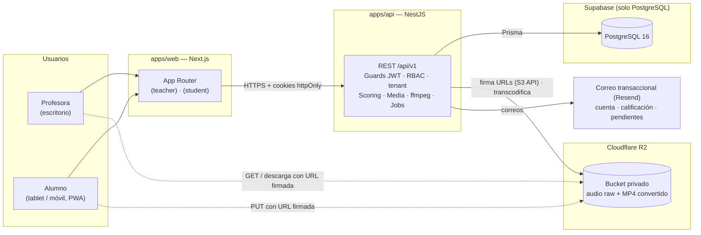
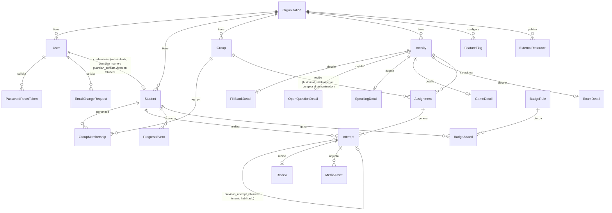
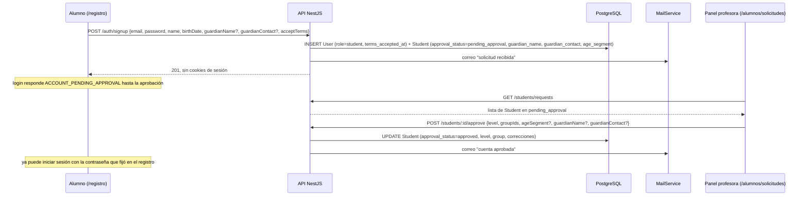
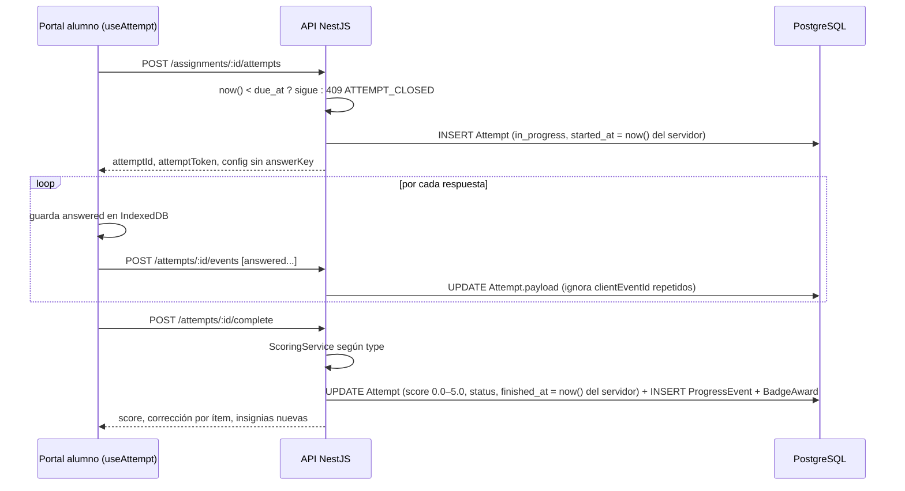

# Englove — Architecture Overview

> **Propósito.** Vista técnica de cómo se construye Englove: piezas, fronteras, flujos y reglas de implementación. Desarrolla lo que `.agents/CONTEXT.md` fija en §4, §6, §7, §10 y §11. Ante cualquier conflicto, manda `CONTEXT.md`.
>
> Estados usados en este documento:
> - **Decidido**: proviene de `CONTEXT.md` o fue aceptado en su §14. No se cambia sin nueva entrada allí.
> - **Propuesto**: detalle de implementación que este documento añade y aún no se ha confirmado (lista en §14).
> - **Pendiente**: requiere decisión humana.
>
> Documentos hermanos: [`sdd-process.md`](./sdd-process.md) (metodología), [`pbp-development.md`](./pbp-development.md) (etapas de construcción) y [`taskboard.md`](./taskboard.md) (tareas y estado). Las specs de `specs/` detallan cada capacidad a partir de este documento.
>
> Última actualización: 2026-09-22. Aplica `planning/incongruencias-y-decisiones-definitivas.md` (CONTEXT §14, decisión 34): sin `Guardian` ni consentimiento, Cloudflare R2 en lugar de Supabase Storage, transcodificación de audios, timestamps en servidor, algoritmo de rachas, rate limiting, `age_segment`, denominador congelado, estados de error y notificación de actualizaciones de la PWA. Los detalles nuevos se listan en §14.3.

---

## Índice

1. Vista general
2. Estructura del monorepo
3. Frontend (`apps/web`)
4. Backend (`apps/api`)
5. Paquete compartido y contrato de actividad
6. Modelo de datos
7. Flujos clave
8. Multi-tenant y seguridad
9. Gamificación y estadísticas
10. Offline, PWA y accesibilidad
11. Entornos, CI/CD y despliegue
12. Observabilidad y calidad
13. Convenciones de código y API
14. Decisiones añadidas por este documento
15. Preguntas abiertas de arquitectura

---

## 1. Vista general

Englove es una aplicación web con dos superficies (panel de la profesora y portal del alumno) servidas por una misma app Next.js, una API NestJS que concentra toda la lógica de negocio, Supabase usado únicamente como PostgreSQL y Cloudflare R2 como almacenamiento de archivos (Decidido, decisión 34 §21).



Despliegue (Decidido, CONTEXT §6): `apps/web` en **Vercel**, `apps/api` en **Render**, ambos bajo el mismo dominio raíz (§11). Archivos en **Cloudflare R2**.

**Principios que gobiernan el diseño (Decidido, CONTEXT §7.1):**

1. NestJS es el único backend de negocio. El frontend nunca habla con Postgres ni decide autorización.
2. Multi-tenant desde el esquema: `organization_id` en toda tabla de tenant, aunque el piloto tenga una sola organización.
3. `Activity` → `Assignment` → `Attempt` es el eje de todo flujo de aprendizaje.
4. Tabla base + tabla de detalle 1:1 por tipo de actividad.
5. Progreso como eventos append-only (`ProgressEvent`).
6. Puntaje calculado en servidor.
7. Feature flags por organización en base de datos.

**Lo que esta arquitectura no incluye en el piloto (Decidido, CONTEXT §2.4):** WebSockets, heartbeat, pantallas de `parent` y `admin`, Capacitor, muro social, Phaser, iframes de Educaplay, pagos, ni ninguna gestión de consentimiento legal de menores. Si una tarea parece necesitarlos, se detiene y se propone en CONTEXT §14.

---

## 2. Estructura del monorepo — Decidido (A1)

Herramientas: pnpm workspaces + Turborepo. Justificación: caché de builds y ejecución de tareas por paquete con configuración mínima, sin generadores de código ni capas adicionales.

```
englove/
├── .agents/CONTEXT.md          # fuente de verdad de producto y decisiones
├── planning/                   # este documento, proceso SDD, etapas, taskboard
├── specs/                      # especificaciones por capacidad (SPEC-01 … SPEC-10), ver sdd-process.md
├── apps/
│   ├── web/                    # Next.js: panel profesora + portal alumno + PWA
│   └── api/                    # NestJS: API REST, scoring, media, jobs programados
├── packages/
│   └── shared/                 # enums, esquemas Zod por tipo de actividad, contrato de actividad, tipos de API
├── tooling/                    # tsconfig, eslint y prettier compartidos
├── docker-compose.yml          # Postgres 16 local
├── pnpm-workspace.yaml
├── turbo.json
└── package.json
```

Reglas de dependencia:

- `apps/web` → `packages/shared`.
- `apps/api` → `packages/shared`.
- `packages/shared` no importa nada de `apps/*` ni de Prisma. Es TypeScript puro + Zod.
- No existe `packages/ui`. Los tokens y componentes viven en `apps/web` hasta que aparezca una segunda aplicación que los necesite. Capacitor (Fase 2) empaqueta la misma web, así que probablemente nunca haga falta.

---

## 3. Frontend (`apps/web`)

### 3.1 Estructura de rutas — Decidido

```
apps/web/src/app/
├── (public)/
│   ├── login/                  # profesora y alumno: correo + contraseña (la API resuelve el rol)
│   ├── registro/               # auto-registro del alumno: crea cuenta en pending_approval
│   ├── recuperar-contrasena/   # solicitar enlace de recuperación
│   └── restablecer/[token]/    # nueva contraseña con enlace de un solo uso
├── (teacher)/
│   ├── layout.tsx              # tema neutro, navegación lateral
│   ├── inicio/                 # dashboard: tarjetas de recordatorio (solicitudes pendientes, sin calificar > N días)
│   ├── actividades/            # gestor de contenidos
│   ├── asignaciones/
│   ├── revision/               # calificación y feedback: cola manual + intentos autocalificados + habilitar nuevo intento + descarga de audio
│   ├── alumnos/                # pestañas: Alumnos (edición, datos del acudiente, iniciar recuperación) · Solicitudes · Bloqueados
│   ├── grupos/
│   ├── estadisticas/           # rendimiento y constancia por alumno y grupo + leaderboard privado (solo RBAC teacher)
│   └── contenido-extra/
└── (student)/
    ├── layout.tsx              # fija data-theme según age_segment
    ├── inicio/                 # asignaciones abiertas
    ├── actividad/[attemptId]/  # renderizador
    ├── juegos/                 # lista → juego
    ├── progreso/               # resumen → insignias / rachas
    ├── feedback/               # lista → detalle por actividad
    ├── extra/                  # contenido extra (flag extra_content)
    └── perfil/                 # cambio de correo con OTP · alternar Kids/Teens si can_switch_interface (acceso desde el avatar, no ocupa entrada de la barra)
```

`middleware.ts` de Next solo comprueba la presencia de la cookie de sesión y el rol para redirigir entre grupos de rutas. La autorización real la aplica la API en cada petición.

**Sección de bloqueados (Decidido, decisión 34 §8):** la pestaña `alumnos/bloqueados` lista las cuentas de alumnos con `locked_until` vigente y ofrece desbloqueo manual en un clic (`POST /students/:id/unlock`). **Recordatorios del dashboard:** `inicio/` del panel muestra tarjetas minimalistas (contador + enlace directo) alimentadas por `GET /dashboard/reminders` (§4.1): solicitudes de registro pendientes y actividades sin calificar hace más de `ungraded_reminder_days` (3 por defecto). No sobrecargan el dashboard ni sustituyen al panel estadístico.

**Regla de navegación (Decidido, CONTEXT §5.2 y §14 decisión 29): entre 2 y 4 clics según la zona**, contando desde `inicio` y sin contar el login. Cada zona tiene un techo propio y la spec de la Etapa 5 lo verifica pantalla por pantalla:

| Zona | Destino final | Clics máximos | Ruta típica |
|---|---|---|---|
| Actividades asignadas | Empezar una actividad | **2** | `inicio` → tarjeta de asignación → renderizador |
| Juegos | Empezar un microjuego | **3** | `inicio` → `juegos` → juego |
| Progreso | Detalle de una insignia o de la racha | **3** | `inicio` → `progreso` → insignia |
| Feedback | Leer el comentario de la profesora sobre un intento | **3–4** | `inicio` → `feedback` → actividad → intento (si hubo más de uno) |
| Contenido extra | Abrir un enlace externo | **3** | `inicio` → `extra` → enlace |

Principios que mantienen la simpleza dentro del rango: la barra de navegación del alumno siempre visible con como máximo cinco entradas; sin menús anidados; ninguna pantalla intermedia que solo contenga un botón; el botón "volver" siempre lleva a la pantalla anterior de la misma zona.

### 3.2 Datos y estado — Decidido (A2)

- TanStack Query para todo acceso a la API: caché, reintentos, y `refetchInterval: 30_000` en estadísticas y cola de revisión (el "polling cada 30 s" de CONTEXT §2.4).
- Sin gestor de estado global adicional. El estado de una actividad en curso vive en el hook `useAttempt` y en la cola offline (§10).
- Formularios del panel con react-hook-form y resolvers de Zod, reutilizando los esquemas de `packages/shared`. El formulario de cada tipo de actividad se deriva de su esquema: un cambio en el esquema, un cambio en el formulario.

### 3.3 Sistema de diseño y temas — Decidido (CONTEXT §8 y decisión 20)

- Un solo conjunto de tokens con dos valores: `[data-theme="kids"]` y `[data-theme="teens"]` como CSS variables (`--color-*`, `--font-*`, `--space-*`, `--radius-*`, `--motion-*`, `--sound-*`). Tailwind los consume vía `theme.extend`.
- Los componentes del alumno se construyen una sola vez y leen el conjunto activo. Solo hay variantes estructurales donde la diferencia lo exige: layout de la zona de juegos y densidad de la home.
- El panel de la profesora usa shadcn/ui con un tema neutro y no participa del sistema Kids/Teens.
- Framer Motion sin restricción (Decidido). Las variantes de animación viven en `motion/kids.ts` y `motion/teens.ts` y se cargan con `next/dynamic` según el tema activo: cada audiencia descarga solo su bundle.
- Howler.js para efectos de sonido (activados por defecto en Kids, configurables en Teens) y canvas-confetti en celebraciones.

### 3.4 Renderizador de actividades

`ActivityRenderer` recibe `{ type, config, attemptToken }` y monta el componente del tipo correspondiente. Todos los componentes de actividad, fichas y microjuegos por igual, consumen `useAttempt()`, que implementa el contrato de actividad (§5): emite `started`, `answered` y `completed`, encola offline y reintenta. Ningún componente de actividad llama a la API directamente.

### 3.5 Speaking en el navegador — Decidido (decisión 34 §13 y §22)

Cada plataforma graba en un codec distinto y no todos los navegadores reproducen todos los formatos:

| Plataforma del alumno | Formato grabado |
|---|---|
| Chrome / Edge / Android | `audio/webm;codecs=opus` |
| Safari iOS / macOS | `audio/mp4` (AAC) |
| Firefox | `audio/ogg;codecs=opus` |

La solución tiene **dos capas complementarias** que no cambian la arquitectura de R2 ni el contrato de la API.

**Capa 1 — Cliente: grabación óptima por dispositivo.** Antes de grabar, `useAttempt` detecta el formato soportado con `MediaRecorder.isTypeSupported()` en este orden de preferencia:

```ts
function getSupportedMimeType(): string {
  const types = [
    "audio/webm;codecs=opus",
    "audio/webm",
    "audio/mp4",
    "audio/ogg;codecs=opus",
    "audio/ogg",
  ];
  return types.find((t) => MediaRecorder.isTypeSupported(t)) ?? "";
}
```

El `mime_type` detectado viaja en `POST /media/upload-url` y se persiste en `MediaAsset.mime_type`. El alumno graba siempre en el codec nativo de su dispositivo, sin librerías de terceros ni encoders WASM (un WAV sin compresión pesaría ~10× más que MP4; con el tope de 5 minutos llegaría a ~50 MB, inviable en conexiones móviles). El blob se guarda en IndexedDB antes de intentar la subida; si falla, el intento queda "pendiente de envío" y se reintenta (§10).

**Capa 2 — Servidor: transcodificación a MP4/AAC para reproducción universal.** Al confirmar la subida (`MediaAsset.status = ready`), el módulo `media` encola una tarea asíncrona con `ffmpeg` (`fluent-ffmpeg`) que convierte el raw a `audio/mp4` (AAC, mono, 64 kbps) y lo guarda en R2 bajo la clave `<assetId>_converted.mp4`; al terminar actualiza `MediaAsset.converted_key` y elimina el raw. La profesora recibe siempre la URL firmada del archivo convertido, reproducible en Chrome, Safari, Firefox, Edge, iOS y Android. El alumno no reproduce audios.

```
Alumno graba → WebM | MP4 | OGG (nativo)
  → PUT a R2 (raw, clave <assetId>.<ext>)
  → complete → MediaAsset.status = ready
  → job de transcodificación → <assetId>_converted.mp4 en R2
  → MediaAsset.converted_key actualizado, raw eliminado
  → profesora reproduce o descarga el MP4 en cualquier navegador
```

Si la transcodificación falla, `converted_key` queda `null`, el raw se conserva y el panel muestra el raw como fallback con un aviso visual de que puede no reproducirse en todos los navegadores. El intento no se bloquea ni se pierde. El job de retención (§4.5) borra raw y convertido al vencer `retention_until`.

**Duración de los audios (Decidido, decisión 34 §13):**

| Parámetro | Valor | Dónde vive |
|---|---|---|
| Duración mínima | 2 s, fija | `SpeakingDetail.min_duration_seconds` (no editable) |
| Duración máxima por defecto | 120 s | `SpeakingDetail.max_duration_seconds` |
| Duración máxima absoluta | 300 s | tope validado por el esquema Zod y por la API |

La profesora ajusta la duración máxima por actividad dentro del rango 2 s – 300 s desde el formulario de speaking. El servidor mide la duración real con `ffprobe` al confirmar la subida: un audio menor de 2 s se rechaza con `AUDIO_IMPLAUSIBLE_DURATION`; uno mayor que el máximo configurado, con `AUDIO_EXCEEDS_MAX_DURATION`. El cliente detiene la grabación al alcanzar el máximo y muestra el tiempo restante.

### 3.6 Estados de error en el cliente — Decidido (decisión 34 §17)

Toda situación indeseada tiene un estado de error claro, amigable y contextual:

- `ErrorBoundary` global en `apps/web` y un `ErrorState` reutilizable por zona (`inicio`, `actividad`, `revision`, etc.) con variantes por tema: en Kids, visual y simpático (ilustración + frase corta + botón grande); en Teens y en el panel, directo y claro.
- Casos cubiertos: red o servidor (500, 503), acceso no autorizado (401, 403: "No tienes acceso a esta sección"), recurso no encontrado (404), actividad cerrada o expirada (`ATTEMPT_CLOSED`: "No fue posible tomar tu intento porque la actividad ya cerró. Comunícate con tu maestra para ver si hay opción de volver a habilitarla."), intento ya existente sin habilitación (`ATTEMPT_ALREADY_EXISTS`), fallo en la subida de audio (con reintento), y un genérico para cualquier otro código.
- Los mensajes **nunca** muestran stack traces, códigos internos ni detalles técnicos. El `code` de la API (§13) se traduce a texto en español en un mapa único del cliente; lo no mapeado cae en el genérico.
- La captura de errores (§12) recibe el error con rol y versión, sin datos personales.

### 3.7 Actualizaciones de la PWA — Decidido (decisión 34 §4)

Cuando el service worker detecta una nueva versión del frontend (evento `waiting` de Serwist) o la API responde con el header `X-App-Min-Version` mayor que la versión cargada, la app muestra una **notificación in-app no bloqueante**: "Hay una actualización disponible. La aplicación necesita reiniciarse para aplicar los cambios." con un botón que ejecuta `skipWaiting` y recarga. Aplica al panel y al portal, con texto y estilo adaptados al tema (más simple y visual en Kids). Nunca se actualiza en silencio a mitad de un intento: si hay un intento en curso, la notificación espera a que termine o se abandone la pantalla.

---

## 4. Backend (`apps/api`)

### 4.1 Módulos planos — Decidido (CONTEXT §6 y decisión 20)

Cada módulo es `controller` → `service` → Prisma. Sin repositorios genéricos, sin CQRS, sin eventos de dominio en el piloto.

| Módulo | Responsabilidad | Endpoints principales |
|---|---|---|
| `auth` | login con correo y contraseña (todos los roles), auto-registro del alumno (crea `User` + `Student`), refresh rotativo, logout, recuperación de contraseña, cambio de correo con OTP, bloqueo por intentos | `POST /auth/login`, `POST /auth/signup`, `POST /auth/refresh`, `POST /auth/logout`, `POST /auth/forgot-password`, `POST /auth/reset-password`, `POST /me/email-change`, `POST /me/email-change/confirm` |
| `students` | alumnos, nivel, segmento, datos del acudiente (`guardian_name`, `guardian_contact`), aprobación de solicitudes, iniciar recuperación de contraseña, bloqueados y desbloqueo, cambio de interfaz, borrado en cascada | `GET/PATCH/DELETE /students`, `GET /students/requests`, `POST /students/:id/approve`, `POST /students/:id/reject`, `POST /students/:id/reset-password` (envía el enlace al correo del alumno), `GET /students/locked`, `POST /students/:id/unlock`, `PATCH /me/interface` |
| `groups` | grupos y membresías | `/groups`, `/groups/:id/members` |
| `activities` | CRUD de actividades y detalle por tipo, estados, versionado, normalización de pesos de examen, mínimo de ítems al publicar | `/activities`, `POST /activities/:id/publish`, `POST /activities/:id/duplicate` |
| `assignments` | asignación a grupos con fechas; `historical_student_count` | `/assignments`, `GET /me/assignments` |
| `attempts` | ciclo start / events / complete, scoring, control de un intento por asignación, validación de `due_at` sobre `started_at` del servidor | `POST /assignments/:id/attempts`, `POST /attempts/:id/events`, `POST /attempts/:id/complete` |
| `reviews` | cola de revisión, calificación 0,0–5,0, feedback, correo de notificación al alumno (sin nota ni feedback), habilitar nuevo intento | `GET /reviews/queue`, `GET /reviews/graded`, `POST /attempts/:id/review`, `POST /attempts/:id/grant-retry` |
| `progress` | `ProgressEvent`, insignias, rachas | `GET /me/progress`, `GET /students/:id/progress` |
| `stats` | rendimiento y constancia por alumno y grupo; leaderboard privado. **Acceso solo por `RolesGuard('teacher')`, sin feature flags** | `GET /stats/students/:id`, `GET /stats/groups/:id`, `GET /stats/overview`, `GET /stats/leaderboard` |
| `dashboard` | contadores de pendientes de la profesora (solicitudes, sin calificar > N días); el mismo `PendingSummaryService` alimenta el correo cada 3 días (§4.5) | `GET /dashboard/reminders` |
| `media` | URLs firmadas de subida, reproducción y descarga sobre R2 (S3 API), `MediaAsset`, validación de duración con `ffprobe`, transcodificación a MP4/AAC con `ffmpeg` (tarea interna disparada tras confirmar la subida, no expuesta a clientes), retención | `POST /media/upload-url`, `GET /media/:id/url`, `GET /media/:id/download-url` |
| `resources` | contenido extra (enlaces externos) | `/resources` |
| `feature-flags` | flags y configuración por organización | `GET /feature-flags` |
| `health` | liveness y conexión a base de datos | `GET /health` |

No existe módulo `guardians` ni ningún endpoint de consentimiento (decisión 34 §1 y §2). No existe `POST /students`: la única vía de alta es `POST /auth/signup`.

### 4.2 Validación en dos niveles — Decidido (A5)

CONTEXT pide DTOs con `class-validator` en todos los endpoints (§6) y esquemas Zod compartidos por tipo de actividad (§6, Repositorio). Conviven así:

- **class-validator** valida la forma de cada petición: campos obligatorios, tipos, longitudes, enums.
- **Zod** (desde `packages/shared`) valida el contenido específico de un tipo de actividad: el campo `config` al crear o editar una actividad, y el campo `answers` al enviar respuestas. Se aplica con un `ZodValidationPipe` que selecciona el esquema según `activity.type`.

Regla: nada específico de un tipo de actividad se valida con class-validator; nada de la envoltura HTTP se valida con Zod.

### 4.3 Guards y contexto de tenant — Decidido (A4)

Orden de ejecución: `JwtAuthGuard` → `RolesGuard` → `TenantContext`.

- El JWT contiene `sub` (user id), `role`, `org` (organization_id), `sid` (familia de sesión) y, para alumnos, `student_id` y `age_segment`. El login es el mismo endpoint para todos los roles; el rol sale de `User.role`, nunca del cliente.
- `TenantContext` expone `organization_id` durante toda la petición mediante AsyncLocalStorage.
- Una extensión de Prisma Client añade `where: { organization_id }` a todas las operaciones sobre modelos de tenant. Los servicios además filtran explícitamente. El doble filtro es deliberado: defensa en profundidad para el multi-tenant real de Fase 2.
- Un test de esquema verifica que toda tabla marcada como tenant tiene `organization_id`.

### 4.4 Scoring — Decidido (en servidor, A15; escala 0,0–5,0 por decisión 24)

`ScoringService` delega en una estrategia por tipo. Cada scorer produce una **fracción de acierto** entre 0 y 1; `ScoringService` la convierte a la **escala colombiana 0,0–5,0** con un decimal (`round(fraction × 5, 1)`) y la guarda en `Attempt.score`. Ningún scorer ni cliente escribe directamente en la escala.

| Tipo | Scorer (fracción de acierto) | Resultado |
|---|---|---|
| `fill_blank` | ítems correctos / ítems totales, comparando `answers` con `answerKey`; un hueco sin respuesta cuenta como incorrecto | `graded`, corrección por ítem |
| `exam` | media ponderada de sus ítems; cada ítem reutiliza el scorer de su subtipo; pesos normalizados en `ExamDetail`; un ítem no respondido aporta 0 y su peso entra en el denominador | `graded` |
| `game` | por mecánica: aciertos, errores y tiempo según fórmula del esquema de la mecánica; valida duración plausible | `graded` |
| `open_question` | ninguno; la profesora introduce el `score` 0,0–5,0 en la revisión | `pending_review` |
| `speaking` | ninguno; la profesora introduce el `score` 0,0–5,0 en la revisión | `pending_review` |

Reglas de la escala:

- `Attempt.score` y `Review.score` son `numeric(2,1)` entre `0.0` y `5.0`. La API rechaza cualquier otro valor con `SCORE_OUT_OF_RANGE`.
- Umbral de aprobación `3.0` (Decidido), leído de `FeatureFlag`/configuración de la organización como `passing_score`. Determina el estado visual "aprobado / por mejorar" en el portal y en el panel; no bloquea nada.
- La interfaz muestra la coma decimal (`4,5`); la API y la base de datos usan punto (`4.5`).
- Las estrellas del alumno se derivan del `score`: 0–1 estrellas por debajo del umbral, 2 estrellas entre el umbral y 4,4, 3 estrellas de 4,5 en adelante (Decidido, A16).

Validación de plausibilidad: si `finished_at - started_at` es menor que un mínimo por tipo (por ejemplo, 3 s por ítem), el intento se califica igual pero se marca con `flags: ['implausible_duration']` para que la profesora lo vea. No se rechaza: un niño que responde rápido no debe perder su trabajo. Los umbrales viven en la configuración de la actividad con valores por defecto. La única excepción es el audio de speaking menor de 2 s, que sí se rechaza (§3.5).

**Reloj del servidor (Decidido, decisión 34 §3).** `started_at` y `finished_at` (y `graded_at`, `occurred_at`, `reviewed_at`) los asigna la API en el momento en que recibe y procesa la petición (`new Date()` en NestJS o `now()` en PostgreSQL). El cliente nunca los envía; si los envía, `whitelist: true` los descarta. Es lo que hace fiables la validación de plausibilidad, las estadísticas de tiempo, las rachas y la regla de `due_at` (§7.5).

**Reglas de examen (Decidido, decisión 34 §11 y §12):**

- **Ítem no respondido = puntaje 0.** El peso del ítem entra en el denominador. No responder equivale a responder incorrectamente, para todos los tipos de ítem sin excepción.
- **Mínimo 2 ítems para publicar.** Se valida en `POST /activities/:id/publish` con `EXAM_MIN_ITEMS`, no al crear: la profesora puede guardar un examen incompleto como borrador sin restricciones.
- **Normalización automática de pesos.** Al guardar un examen (`POST`/`PATCH /activities`), si la suma de pesos no es exactamente 100 la API los ajusta proporcionalmente (`peso_i × 100 / suma`, redondeo a un decimal con corrección del residuo en el último ítem) y devuelve los valores efectivos. El formulario muestra siempre el peso real tras la normalización, con un mensaje que informa del ajuste. El resultado sigue en la escala 0,0–5,0 con umbral 3,0.

### 4.5 Tareas programadas — Decidido (decisiones 20, 27 y 32)

Con `@nestjs/schedule`:

- Nocturna: marcar `abandoned` los intentos `in_progress` cuya asignación cerró hace más de 24 h (el mismo margen del `attemptToken`, §7.5). Un intento iniciado antes de `due_at` puede terminarse después del cierre (decisión 34 §10); solo se abandona el que nunca se completó.
- Nocturna, **retención de audios** (Decidido, CONTEXT §9, decisiones 27 y 34 §6): borrar de R2 el raw y el `_converted.mp4` de los `MediaAsset` con `retention_until < now()` (`retention_until = graded_at + 30 días`); borrar los `MediaAsset` en `pending_upload` creados hace más de `pending_upload_ttl_days` (7); reintentar los `pending_delete` que fallaron. Al borrar, el registro pasa a `deleted` y conserva `attempt_id`, `mime_type`, `duration_seconds` y `deleted_at` para trazabilidad; `Review` y `Attempt.score` no se tocan. Ambos plazos son configurables por organización.
- Nocturna: desbloquear cuentas cuyo bloqueo por intentos fallidos ya venció (limpieza; el desbloqueo real es por comparación de `locked_until` en el login).
- Semanal (lunes 00:05 America/Bogota): recalcular rachas con el algoritmo de §9.3 y emitir `streak_week`.
- **Mensual (día 1, 00:10 America/Bogota) — edad e interfaz (Decidido, decisión 34 §15):** recalcular la edad de cada `Student` desde `birth_date`; a quien haya cumplido 11 años se le activa `can_switch_interface = true`. No cambia `age_segment`: solo habilita la opción; el alumno elige desde su perfil.
- **Cada 3 días (08:00 America/Bogota) — pendientes de la profesora (Decidido, decisión 34 §18):** `PendingSummaryService` cuenta solicitudes de registro sin aprobar y actividades sin calificar con más de `ungraded_reminder_days` desde su cierre. Si hay al menos un pendiente, `MailService.sendTeacherPendingSummary` envía un correo con el detalle y un enlace directo a cada sección. Si no hay ninguno, no se envía nada.
- **Al confirmar una subida (tarea disparada, no cron) — transcodificación (Decidido, decisión 34 §22):** se encola una tarea `ffmpeg` que convierte el raw a MP4/AAC, sube `<assetId>_converted.mp4` a R2, actualiza `MediaAsset.converted_key` y borra el raw. Si falla, `converted_key` queda `null` y el raw se conserva (§3.5). Cola en memoria con reintento (3 intentos con backoff); sin Redis en el piloto (A14).

Ninguna tarea programada envía la nota ni el feedback por correo; la notificación de calificación la dispara `POST /attempts/:id/review` (§7.7).

### 4.6 Configuración y logging

- `@nestjs/config` con esquema de validación de variables de entorno. El proceso no arranca si falta un secreto.
- Logging JSON con `nestjs-pino`: `request_id`, `user_id`, `role`, `organization_id`, ruta, latencia, resultado. Nunca cuerpos de petición, contenido de respuestas abiertas, contraseñas, tokens de recuperación ni rutas de audio.

---

## 5. Paquete compartido y contrato de actividad

### 5.1 Contenido de `packages/shared` — Decidido (decisión 20)

```
packages/shared/src/
├── enums.ts                # Role, Level, AgeSegment, ActivityType, GameMechanic, AttemptStatus, ApprovalStatus, MediaAssetStatus... (sin ConsentStatus ni ConsentMethod; Role sin guardian)
├── contract.ts             # ActivityEvent, ActivityRuntimeProps, AttemptResult
├── activities/
│   ├── fill-blank.ts       # configSchema, answerKeySchema, answersSchema
│   ├── open-question.ts
│   ├── speaking.ts
│   ├── game.ts             # unión discriminada por mecánica
│   ├── exam.ts
│   └── registry.ts         # ActivityType → esquemas + toPublicConfig()
└── api/                    # tipos de respuesta compartidos entre web y api
```

### 5.2 Contrato de actividad (Decidido en CONTEXT §7.3)

```ts
export type ActivityEvent =
  | { type: 'started'; at: string }
  | { type: 'answered'; at: string; itemId: string; answer: unknown; clientEventId: string }
  | { type: 'completed'; at: string };

export interface ActivityRuntimeProps<TConfig> {
  attemptToken: string;
  config: TConfig;                        // validado por el esquema Zod del tipo
  onEvent: (event: ActivityEvent) => void;
}
```

- **Entrada:** `config` validado por su esquema Zod + `attemptToken`.
- **Salida:** eventos `started`, `answered`, `completed` hacia la API a través de `useAttempt`.
- El campo `at` de cada evento es **informativo para el cliente** (orden local, cola offline). El servidor lo ignora al fijar `started_at` y `finished_at`: toda marca de tiempo persistida es del reloj del servidor (decisión 34 §3). Los DTOs de `start`, `events` y `complete` no aceptan ningún campo de timestamp.
- El backend valida, califica y persiste `Attempt` y los `ProgressEvent` correspondientes.
- Phaser (Fase 2) implementa `ActivityRuntimeProps` como un componente más. Nada cambia en la API ni en el panel de la profesora.

### 5.3 Regla de la clave de respuestas — Decidido (A6)

El puntaje en servidor solo protege si la clave no viaja al cliente.

- Tipos calificados (`fill_blank`, `exam`): `registry.toPublicConfig()` elimina `answerKey` antes de responder al alumno. La corrección por ítem se devuelve en la respuesta de `complete`, no antes.
- Microjuegos (`game`): la mecánica necesita la clave para dar feedback inmediato (por ejemplo, saber si dos tarjetas emparejan). Se acepta que la clave viaje: son actividades de práctica de bajo riesgo, y el servidor recalcula el puntaje y valida duraciones.
- `speaking` y `open_question` no tienen clave.

### 5.4 Añadir un tipo de actividad (Decidido en CONTEXT §16)

Tres piezas, siempre juntas: esquema Zod en `packages/shared/activities`, tabla de detalle 1:1 en `schema.prisma`, componente que implementa el contrato en `apps/web`. Si el tipo es autocalificable, una cuarta: su scorer en `apps/api`.

---

## 6. Modelo de datos

`schema.prisma` será la referencia autoritativa cuando exista (CONTEXT §7.2). Este apartado fija convenciones y relaciones para escribirlo.

### 6.1 Diagrama de relaciones



No existen `Guardian` ni `ConsentRecord` (decisión 34 §1 y §2).

### 6.2 Convenciones — Decidido (A7 y decisión 20)

- Claves primarias `uuid`. `created_at` y `updated_at` en toda tabla; `timestamptz` en UTC.
- **Toda marca de tiempo en tablas de tenant se escribe en el servidor** (`now()` de PostgreSQL o `new Date()` de NestJS). Los campos de tiempo no son parte de ningún DTO de entrada (Decidido, decisión 34 §3).
- `organization_id` obligatorio en toda tabla de tenant. La única tabla sin él es `Organization`.
- Identificadores en inglés: modelos en `PascalCase`, columnas en `snake_case` mediante `@map`.
- Borrado: `Student` se borra en cascada real (§8.4), congelando antes el denominador histórico de sus asignaciones. `Activity` con intentos no se borra; se archiva (`status = archived`).
- `Attempt.payload` guarda las respuestas crudas como JSON, cada una con su `clientEventId`. No hay tabla de eventos de intento en el piloto.

### 6.3 Enums — Decidido (decisión 20)

| Enum | Valores |
|---|---|
| `Role` | `teacher`, `student`, `parent` (reservado, Fase 2), `admin` (reservado). No existe `guardian` |
| `Level` | `A1`, `A2`, `B1`, `B2` |
| `AgeSegment` | `kids`, `teens`. Es la interfaz activa, no la edad: un alumno de 11+ puede tener `kids` si eligió quedarse en esa interfaz (decisión 34 §15) |
| `ActivityType` | `fill_blank`, `open_question`, `speaking`, `game`, `exam` |
| `ActivityStatus` | `draft`, `published`, `archived` |
| `GameMechanic` | `match`, `order_words`, `drag_drop`, `memory`, `timed_choice` |
| `AttemptStatus` | `in_progress`, `pending_review`, `graded`, `abandoned` |
| `ApprovalStatus` | `pending_approval`, `approved`, `rejected` |
| `ProgressEventType` | `attempt_completed`, `audio_submitted`, `review_received`, `retry_granted`, `streak_week`, `badge_awarded` |
| `MediaAssetStatus` | `pending_upload`, `ready`, `pending_delete`, `deleted` |

Eliminados por la decisión 34: `ConsentStatus`, `ConsentMethod` (§2) y `RegistrationSource` (§1: el auto-registro es la única vía de alta, así que el origen ya no distingue nada).

### 6.4 Campos que merecen nota

- `User`: `email` **obligatorio y único por organización** para todos los roles (Decidido, decisión 22), `password_hash` (argon2id), `role`, `organization_id`, `failed_login_count`, `locked_until`, `terms_accepted_at`, `terms_version` (T&C convencional aceptado en el registro). `Student.user_id` es 1:1 obligatorio. El correo de acceso del alumno vive en `User.email`. No existe `must_change_password`: no hay contraseñas temporales.
- `PasswordResetToken`: `user_id`, `token_hash`, `expires_at` (30 min), `used_at`. Se guarda el hash, nunca el token; un token usado o caducado no se reutiliza. Lo crea `POST /auth/forgot-password` o la profesora desde `POST /students/:id/reset-password`; en ambos casos el enlace va al correo del alumno.
- `EmailChangeRequest` (Decidido, decisión 34 §1): `user_id`, `new_email`, `otp_hash` (6 dígitos), `expires_at` (10 min), `used_at`. `POST /me/email-change { newEmail, password }` valida la contraseña actual y el correo nuevo único, y envía el OTP al correo nuevo; `POST /me/email-change/confirm { otp }` aplica el cambio y revoca las demás sesiones. Máximo 3 OTP fallidos por solicitud.
- `Student`: `name`, `birth_date`, **`guardian_name` (string, nullable)** y **`guardian_contact` (string, nullable; teléfono o correo)** capturados en el auto-registro y editables solo por la profesora (`PATCH /students/:id`; el alumno no los ve en su perfil como editables). `age_segment` se calcula al registrarse desde `birth_date`; **`can_switch_interface` (boolean, false por defecto)** se activa al registrarse si ya tiene 11 años o cuando el job mensual detecta que los cumplió. `PATCH /me/interface { ageSegment }` solo se acepta si `can_switch_interface = true`; el cambio reemite el access token con el nuevo `age_segment` para que el layout aplique el tema sin relogin.
- `Student.approval_status` (Decidido, decisión 33): `pending_approval` al auto-registrarse; `approved` tras la revisión de la profesora; `rejected` es transitorio, se resuelve borrando la fila (§8.4). `Student.level` y la membresía de grupo son `null` mientras está `pending_approval`.
- `SpeakingDetail`: `prompt`, `example_url?`, `min_duration_seconds` (2, fijo), `max_duration_seconds` (120 por defecto, máximo 300). El esquema Zod compartido impone el rango (§3.5).
- `ExamDetail`: lista de ítems con `weight` normalizado a suma 100 al guardar (§4.4).
- `Assignment.historical_student_count` (Decidido, decisión 34 §14): `null` mientras nadie ha sido borrado; al borrar un alumno se fija, para cada asignación de sus grupos, el número de alumnos que tenía la asignación en ese momento (si ya estaba fijado, no se reduce). Las estadísticas usan este valor congelado como denominador para datos históricos y el conteo de alumnos activos para datos presentes (§9.4).
- `Activity.version` y `parent_id`: una actividad publicada **sin** intentos se edita en sitio; **con** intentos solo se duplica (nueva fila con `version + 1` y `parent_id`) o se archiva. Las asignaciones siguen apuntando a la versión con la que se crearon. Así el historial de calificaciones nunca se reescribe.
- **Un intento por asignación con habilitación por la profesora (Decidido, decisión 25).** No existe `Assignment.max_attempts`. `Attempt` lleva `retry_granted_at`, `retry_granted_by` y `previous_attempt_id`. `POST /assignments/:id/attempts` solo crea un intento si el alumno no tiene ninguno para esa asignación, o si su último intento tiene `retry_granted_at` no nulo y aún no se ha usado. El nuevo intento enlaza al anterior con `previous_attempt_id`. Para estadísticas y progreso cuenta **el último intento calificado**; el historial completo queda visible para la profesora.
- `Attempt.score`: `numeric(2,1)` en escala 0,0–5,0 (§4.4).
- `Attempt.started_at` y `Attempt.finished_at`: los fija el servidor al crear y al completar el intento (decisión 34 §3). `started_at` frente a `Assignment.due_at` decide la validez del intento (§7.5).
- `Attempt.flags`: array de texto para marcas como `implausible_duration` u `offline_sync`.
- `MediaAsset`: `key` (raw en R2), **`converted_key` (string, nullable)** con el MP4/AAC transcodificado (decisión 34 §22), `mime_type` detectado en el cliente, `duration_seconds` medido con `ffprobe`, `size_bytes`, `status`. `retention_until` se fija al calificar como `graded_at + retention_days` (30 por defecto). `created_at` gobierna el borrado de `pending_upload` (7 días por defecto). Ver §4.5.
- `Group`: sin `classroom_code`. El acceso por código de aula fue descartado (decisión 22).
- `FeatureFlag(organization_id, key, enabled, config json)`: claves iniciales **`games`, `extra_content`** (sin `stats` ni `leaderboard`: el panel estadístico se controla solo por RBAC, decisión 34 §7); configuración `passing_score = 3.0`, `retention_days = 30`, `pending_upload_ttl_days = 7`, `ungraded_reminder_days = 3` (umbral de los recordatorios y del correo de pendientes, §8 y §18).

### 6.5 Índices iniciales — Decidido (decisión 20)

- `Attempt(assignment_id, student_id, created_at)`; `Attempt(student_id, finished_at)`; índice parcial `Attempt(status) WHERE status = 'pending_review'`.
- `Assignment(group_id, opens_at, due_at)`.
- `ProgressEvent(student_id, occurred_at)`.
- `GroupMembership(group_id, student_id)` único.
- `Activity(organization_id, level, type, status)`.
- `Student(organization_id, approval_status)` para la bandeja de solicitudes.
- `User(organization_id, email)` único; `User(locked_until)` para la sección de bloqueados.
- `PasswordResetToken(token_hash)` único; `PasswordResetToken(expires_at)` para la limpieza. `EmailChangeRequest(user_id, expires_at)`.
- `MediaAsset(status, created_at)` y `MediaAsset(retention_until)` para el job de retención; índice parcial `MediaAsset(status) WHERE converted_key IS NULL AND status = 'ready'` para la cola de transcodificación.
- `Student(organization_id, birth_date)` para el job mensual de edad.

---

## 7. Flujos clave

### 7.1 Login y sesión (profesora y alumno) — Decidido (A3, decisiones 22 y 23)

Un único flujo para todos los roles.

1. `POST /auth/login` con correo y contraseña. Hash con argon2id. La respuesta de error es la misma para "correo no existe" y "contraseña incorrecta" (`AUTH_INVALID_CREDENTIALS`).
2. La API responde con dos cookies `HttpOnly; Secure; SameSite=Lax`: `access_token` (15 min, `Path=/`) y `refresh_token` (`Path=/api/v1/auth/refresh`, rotativo) con duración según rol: **30 días profesora, 90 días alumno**. El "Recuérdame" de CONTEXT §4 es implícito para el alumno.
3. El frontend nunca lee los tokens. Al expirar el acceso, llama a `POST /auth/refresh`; la API emite un par nuevo e invalida el anterior.
4. Reutilización de un refresh ya rotado → se revoca toda la familia de sesión (`sid`) y se exige login de nuevo.
5. `POST /auth/logout` revoca la familia y borra las cookies.
6. El frontend redirige según `role` de la respuesta: `(teacher)` o `(student)`.
7. **Cuenta `pending_approval` (Decidido, CONTEXT §4.1 y decisión 33):** si el `Student` de la cuenta tiene `approval_status = pending_approval`, el login responde `403 ACCOUNT_PENDING_APPROVAL` aunque la contraseña sea correcta, sin emitir cookies. Si es `rejected`, responde `AUTH_INVALID_CREDENTIALS` (no se distingue de una cuenta inexistente).

**Bloqueo por intentos fallidos (Decidido, decisión 23):** cada login fallido incrementa `User.failed_login_count`. Al llegar a **10**, se fija `locked_until = now() + 10 min` y todo intento hasta esa hora responde `AUTH_ACCOUNT_LOCKED` con el tiempo restante, sin comprobar la contraseña. Un login correcto pone el contador a cero. El panel de la profesora muestra los alumnos bloqueados y puede desbloquearlos anticipadamente. La misma regla aplica a la profesora, sin desbloqueo anticipado (Decidido).

### 7.2 Auto-registro del estudiante y aprobación por la profesora — Decidido (CONTEXT §4.1 y decisión 33)

**Única vía de alta** de un alumno en el piloto (decisión 34 §1). No existe alta directa por la profesora ni contraseñas temporales.



1. `POST /auth/signup { email, password, name, birthDate, guardianName?, guardianContact?, acceptTerms }`. Sin autenticación previa (endpoint público); throttler estricto de **10 registros por hora por IP** (§8.3). `acceptTerms` debe ser `true`: es el checkbox de los Términos y Condiciones convencionales, con enlace al documento.
2. La API valida el correo único por organización (una sola en el piloto) y los **requisitos de contraseña: 8 a 16 caracteres, sin espacios** (§7.4). Crea en una transacción solo dos filas: `User` (rol `student`, con la contraseña que el alumno ya fijó, `terms_accepted_at` y `terms_version`) y `Student` (`approval_status = pending_approval`, `level = null`, sin grupo, `guardian_name` y `guardian_contact` como campos propios). No se crea ninguna entidad separada. `age_segment` se calcula desde `birthDate` (`kids` hasta los 10 años, `teens` desde los 11) y `can_switch_interface` se activa si ya tiene 11 o más.
3. La API responde `201` sin emitir cookies: el alumno no queda dentro de la sesión aunque la cuenta exista. Se envía un correo de "solicitud recibida" (no bloqueante para el flujo).
4. `GET /students/requests` (solo `teacher`) lista los `Student` en `pending_approval` con los datos capturados en el registro.
5. `POST /students/:id/approve { level, groupIds, ageSegment?, guardianName?, guardianContact? }`: fija `level` y grupo(s), permite corregir `age_segment` (solo si la fecha de nacimiento era errónea) y los datos del acudiente directamente en el `Student`, y pasa `approval_status` a `approved`. No hay ningún otro control previo a la aprobación.
6. `POST /students/:id/reject`: borra la solicitud completa (`User` y `Student`) con el mismo mecanismo que el borrado en cascada de §8.4. No hay "correo de rechazo": simplemente la cuenta deja de existir.
7. Al aprobar, `MailService` envía el correo "cuenta aprobada"; el alumno inicia sesión con la contraseña que fijó en el paso 1.

### 7.3 Recuperación de contraseña iniciada por la profesora — Decidido (decisión 34 §1)

Sustituye al antiguo flujo alterno de alta directa y a las contraseñas temporales, que quedan eliminados. Ante bloqueo o pérdida de contraseña, la profesora pulsa "Enviar enlace de recuperación" en la ficha del alumno: `POST /students/:id/reset-password` (solo `teacher`) crea el mismo `PasswordResetToken` de §7.4 y envía el enlace **al correo registrado del alumno**. La profesora no ve ni fija la contraseña. Si el alumno perdió el acceso a ese correo, primero cambia el correo desde su perfil (§7.4, cambio de correo con OTP) o, si tampoco puede entrar, la profesora corrige `User.email` desde el panel tras verificar la identidad fuera de la plataforma; ese cambio revoca las sesiones abiertas y queda en el log.

### 7.4 Recuperación de contraseña y cambio de correo — Decidido (decisiones 22, 32 y 34 §1)

Un único `MailService` sobre Resend, con un solo remitente y dominio verificado, envía todos los correos de la plataforma: solicitud recibida, cuenta aprobada, recuperación de contraseña, OTP de cambio de correo, notificación de calificación (§7.7) y resumen de pendientes a la profesora (§4.5). Ninguna otra parte del sistema envía correo.

1. `POST /auth/forgot-password { email }`. La API responde siempre `202` con el mismo mensaje exista o no el correo (no revela cuentas). Límite: **5 solicitudes por hora por IP y por correo** (§8.3).
2. Si existe, crea `PasswordResetToken` (token aleatorio de 32 bytes, se guarda su hash, caduca a los **30 minutos**) y envía por correo transaccional un enlace a `app.<dominio>/restablecer/<token>`.
3. `POST /auth/reset-password { token, newPassword }`. Verifica hash, caducidad y no uso; fija la nueva contraseña; marca `used_at`; **revoca todas las familias de sesión** del usuario; responde `200`.
4. **Requisitos de contraseña (Decidido, decisión 34 §1): mínimo 8 caracteres, máximo 16, sin espacios.** Sin requisitos de complejidad que un niño no pueda recordar; para Kids la pantalla sugiere una frase corta memorable que cumpla el rango. Los mismos requisitos aplican en el auto-registro (§7.2) y en el restablecimiento (§7.3). Código de error: `PASSWORD_POLICY`.
5. **Cambio de correo del alumno con OTP:** desde `perfil/`, `POST /me/email-change { newEmail, password }` verifica la contraseña actual y que el correo nuevo sea único; crea `EmailChangeRequest` con un OTP de 6 dígitos (hash, 10 min) y lo envía al **correo nuevo** (así se comprueba que el alumno controla la nueva dirección). `POST /me/email-change/confirm { otp }` aplica el cambio, avisa al correo anterior y revoca las demás sesiones. Tres OTP fallidos invalidan la solicitud. Cubre el caso del alumno que se registró con el correo del acudiente y luego quiere el suyo.
6. `MailService` tiene una única implementación (Resend) con plantillas `signup-received`, `approved`, `password-reset`, `email-change-otp`, `grading-notification` y `teacher-pending-summary` que comparten remitente, diseño y pie; en `local` escribe el enlace o el aviso en el log en vez de enviarlo.

### 7.5 Intento de actividad y puntaje en servidor



Notas:

- **Un intento por asignación (Decidido, decisión 25).** `POST /assignments/:id/attempts` responde `ATTEMPT_ALREADY_EXISTS` si el alumno ya tiene un intento para esa asignación y no tiene un nuevo intento habilitado (§7.7). Si lo tiene, crea el nuevo `Attempt` con `previous_attempt_id` y consume la habilitación.
- **Regla de `due_at` (Decidido, decisión 34 §10).** La validez la decide el **momento de inicio en el servidor**, no el de finalización:
  - Intento iniciado antes de `due_at` y terminado después → **válido**; `complete` lo guarda y califica normalmente.
  - Petición de inicio después de `due_at` (o del `extendUntil` de un nuevo intento habilitado) → **rechazada** con `409 ATTEMPT_CLOSED`; no se crea ningún `Attempt`. El portal muestra: "No fue posible tomar tu intento porque la actividad ya cerró. Comunícate con tu maestra para ver si hay opción de volver a habilitarla."
- **Reloj del servidor (Decidido, decisión 34 §3).** `started_at` se fija al crear el intento y `finished_at` al procesar `complete`, ambos con la hora de la API. Los DTOs no aceptan ningún timestamp; el `at` de los eventos del contrato es solo informativo (§5.2).
- El `attemptToken` es un JWT corto con `attempt_id`, `student_id` y expiración en `due_at + 24 h`, para permitir sincronización offline tardía de un intento ya iniciado.
- `POST /attempts/:id/events` acepta lotes. Cada `answered` lleva `clientEventId`; los duplicados se ignoran (idempotencia para reintentos offline).
- `complete` calcula el puntaje, fija `finished_at`, emite `ProgressEvent(attempt_completed)` y evalúa insignias en la misma transacción.
- Ningún endpoint acepta `score` desde el cliente (Decidido, CONTEXT §5.3 y §16).

### 7.6 Speaking: grabación, subida, confirmación y transcodificación — Decidido (A9, decisión 34 §13, §21 y §22)

```mermaid
sequenceDiagram
  participant S as Portal alumno
  participant A as API NestJS
  participant R2 as Cloudflare R2
  S->>S: getSupportedMimeType() → MediaRecorder → Blob → IndexedDB
  S->>A: POST /media/upload-url { attemptId, mimeType, sizeBytes }
  A->>A: verifica que el intento es del alumno, tipo speaking, límites
  A->>A: INSERT MediaAsset (pending_upload, mime_type)
  A-->>S: mediaId, uploadUrl (10 min)
  S->>R2: PUT uploadUrl (Blob)
  S->>A: POST /attempts/:id/complete { mediaId }
  A->>R2: HEAD objeto (existe y tamaño coincide)
  A->>A: ffprobe → duration_seconds; valida 2 s ≤ d ≤ max_duration_seconds
  A->>A: MediaAsset ready, Attempt pending_review, ProgressEvent audio_submitted
  A-->>S: ok
  A->>A: encola transcodificación (ffmpeg → MP4/AAC)
  A->>R2: PUT <assetId>_converted.mp4; DELETE raw
  A->>A: MediaAsset.converted_key actualizado
```

- Límite de tamaño por archivo: 10 MB. Duración mínima 2 s (fija) y máxima según `SpeakingDetail.max_duration_seconds` (120 por defecto, tope 300). El servidor mide la duración real con `ffprobe`; fuera de rango responde `AUDIO_IMPLAUSIBLE_DURATION` o `AUDIO_EXCEEDS_MAX_DURATION`, marca el `MediaAsset` como `pending_delete` y el intento sigue `in_progress` para que el alumno vuelva a grabar.
- Claves en R2: raw `{organization_id}/{student_id}/{attempt_id}/{assetId}.{ext}` y convertido `{organization_id}/{student_id}/{attempt_id}/{assetId}_converted.mp4`. Bucket privado; nadie lista el bucket desde el cliente.
- URL de subida: 10 min. URL de reproducción y de descarga (`GET /media/:id/download-url`, con `Content-Disposition: attachment`): 5 min, emitidas solo tras verificar que quien pide es la profesora de la organización. El alumno no reproduce ni descarga audios. La URL apunta a `converted_key` cuando existe; si es `null`, al raw con aviso visual en el panel (§3.5).
- El audio nunca pasa por la API en la subida: va directo del navegador a R2 con la URL firmada. Solo la transcodificación lo descarga al proceso de la API de forma asíncrona.
- SDK: `@aws-sdk/client-s3` y `@aws-sdk/s3-request-presigner` contra el endpoint de R2 (`https://<R2_ACCOUNT_ID>.r2.cloudflarestorage.com`). Variables: `R2_ACCOUNT_ID`, `R2_ACCESS_KEY_ID`, `R2_SECRET_ACCESS_KEY`, `R2_BUCKET_NAME`, `R2_PUBLIC_URL`.

### 7.7 Calificación, feedback y nuevo intento — Decidido (decisiones 24 y 25)

El área `revision/` del panel tiene dos pestañas sobre el mismo componente de detalle de intento:

- **Pendientes:** `GET /reviews/queue` devuelve intentos `pending_review` (audio o pregunta abierta) con filtros por grupo, tipo y fecha. Polling de 30 s.
- **Calificados:** `GET /reviews/graded` devuelve intentos `graded`, incluidos los autocalificados (fichas, exámenes, microjuegos), con los mismos filtros. Aquí la profesora comenta un intento automático o habilita un nuevo intento.

Flujo de revisión manual:

1. La profesora reproduce el audio (URL firmada del MP4 convertido, §7.6) o lee la respuesta, asigna la **calificación 0,0–5,0**, escribe el comentario personal (obligatorio) y elige stickers (opcionales). Junto al reproductor hay un botón **"Descargar audio"** (`GET /media/:id/download-url`) para conservar el archivo en su dispositivo antes de que venza la retención (decisión 34 §6).
2. `POST /attempts/:id/review { score, comment, stickers, allowRetry }` crea `Review` (`graded_at = now()` del servidor), actualiza `Attempt.status = graded` y `Attempt.score`, emite `ProgressEvent(review_received)` con `value = score` y fija `MediaAsset.retention_until = graded_at + retention_days`.
3. Si `allowRetry = true`, en la misma transacción se fija `Attempt.retry_granted_at / retry_granted_by` y se emite `ProgressEvent(retry_granted)`.
4. **Correo de notificación (Decidido, decisión 34 §5):** tras confirmar la transacción, `MailService.sendGradingNotification(studentEmail, activityTitle, feedbackUrl)` envía al alumno un correo que dice únicamente que su actividad ya fue calificada y enlaza a `feedback/` de la app. **El correo no contiene la nota ni el comentario**: ambos se ven solo dentro de la aplicación. El envío es asíncrono y no bloquea la respuesta; si falla se registra y se reintenta una vez.

Habilitar nuevo intento sobre un intento ya calificado (manual o automático): `POST /attempts/:id/grant-retry`. Reglas:

- Solo `teacher`; solo si el intento es el último del alumno para esa asignación y no tiene ya una habilitación sin usar (`RETRY_ALREADY_GRANTED`).
- La habilitación no cambia `due_at`. Si la asignación ya cerró, la profesora puede indicar `extendUntil` (opcional) que se guarda en el `Attempt` habilitado y el nuevo intento lo usa como cierre efectivo.
- El alumno ve en la tarjeta de la actividad "Tu profesora te habilitó un nuevo intento" y puede empezarlo desde `inicio` en 2 clics. El intento anterior y su feedback siguen visibles.
- El nuevo intento pasa por el ciclo completo (§7.5) y, si es de revisión manual, vuelve a la cola. Para estadísticas y progreso cuenta el último intento calificado.

El alumno ve el comentario y los stickers en la vista de esa actividad y en `/feedback`. Sin notificaciones push en el piloto: el correo de notificación le avisa y el feedback aparece al entrar.

### 7.8 Estadísticas con polling — Decidido (A14; foco por decisión 28)

El panel consulta `GET /stats/students/:id`, `GET /stats/groups/:id`, `GET /stats/overview` y `GET /stats/leaderboard` cada 30 s. Todas son lecturas agregadas sobre `Attempt` y `ProgressEvent` con los índices de §6.5. Si alguna supera 500 ms con 100 alumnos, se materializa una vista diaria (`daily_student_activity`) refrescada por el job nocturno. No se introduce caché externa (Redis) en el piloto. El contenido de cada vista se define en §9.4.

---

## 8. Multi-tenant y seguridad

### 8.1 Mapa de controles (CONTEXT §10 → implementación)

| Control (Decidido) | Implementación |
|---|---|
| Refresh tokens rotativos en cookie `httpOnly`; nunca `localStorage` | §7.1; familia de sesión con detección de reutilización; bloqueo 10 intentos / 10 min |
| Cuenta bloqueada hasta aprobación en el auto-registro | §7.2; `ACCOUNT_PENDING_APPROVAL`, sin cookies hasta aprobar |
| Recuperación de contraseña sin revelar cuentas ni tokens | §7.4; respuesta uniforme, hash del token, un solo uso, 30 min, revocación de sesiones; la profesora solo dispara el envío, nunca ve la contraseña |
| Cambio de correo verificado | §7.4; OTP al correo nuevo, contraseña actual requerida, revocación de sesiones |
| URLs firmadas de expiración corta emitidas por el backend | §7.6; verificación de derechos antes de firmar; R2 privado |
| Puntaje y calificación en servidor | §4.4; `score` nunca es campo de entrada de ningún DTO |
| Reloj del servidor para toda marca de tiempo | §4.4, §6.2, §7.5; `started_at`/`finished_at` nunca son campos de entrada (decisión 34 §3) |
| DTOs validados en todos los endpoints | `ValidationPipe` global con `whitelist: true` y `forbidNonWhitelisted: true` + `ZodValidationPipe` |
| Rate limiting por endpoint y global | §8.3 (decisión 34 §20) |
| RBAC en Guards; `organization_id` en toda consulta | §4.3; extensión de Prisma + filtro explícito + test de esquema; panel estadístico solo por `RolesGuard('teacher')` |
| Borrado en cascada probado antes de la función | §8.4; congela el denominador histórico antes de borrar |
| Secretos solo en variables de entorno | `.env.example` sin valores; validación al arrancar; secretos del CI en el proveedor |
| Errores sin detalles técnicos hacia el cliente | §13, §3.6; `{ statusCode, code, message }` sin stack traces ni datos internos |

### 8.2 Cookies, dominios y CORS — Decidido (A13)

Las cookies de sesión requieren que frontend y API compartan dominio registrable: `app.<dominio>` (Vercel) y `api.<dominio>` (Render). Así `SameSite=Lax` funciona y las peticiones `fetch` entre subdominios llevan la cookie. Configuración:

- CORS con allowlist explícita (`https://app.<dominio>`) y `credentials: true`.
- La API rechaza peticiones mutantes cuyo encabezado `Origin` no esté en la allowlist. Es la defensa CSRF adicional a `SameSite=Lax`.
- Plan B si algo falla en el dominio: rewrite de Next.js `/api/*` → API, que deja todo en un solo origen a costa de un salto extra por petición.
- En staging se usa el mismo esquema con `app-staging.` y `api-staging.`; las URLs de vista previa de Vercel (`*.vercel.app`) no comparten dominio con la API y por tanto no tienen sesión: sirven solo para revisar interfaz estática.

### 8.3 Endurecimiento HTTP y rate limiting — Decidido (decisiones 20, 23 y 34 §20)

`helmet`; límite de cuerpo JSON de 1 MB (los audios no pasan por la API en la subida); `Cache-Control: no-store` en respuestas autenticadas.

**Política de rate limiting** con `@nestjs/throttler` (almacenamiento en memoria; una sola instancia en el piloto, A14). Los límites son moderados: bloquean ataques automatizados sin afectar el uso normal.

| Endpoint / grupo | Límite por defecto | Clave |
|---|---|---|
| `POST /auth/login` | 10 intentos / 15 minutos | por IP (además del bloqueo por cuenta de 10 intentos / 10 min, §7.1) |
| `POST /auth/signup` | 10 registros / hora | por IP |
| `POST /auth/forgot-password` | 5 solicitudes / hora | por IP **y** por correo |
| `POST /me/email-change` | 5 solicitudes / hora | por usuario |
| API general autenticada | 120 peticiones / minuto | por usuario (`sub` del JWT) |
| API general no autenticada | 30 peticiones / minuto | por IP |

Al superar un límite la API responde `429 RATE_LIMITED` con `Retry-After`. Los valores viven en configuración con estos defaults. Además, todo formulario de entrada se valida estrictamente con `class-validator` (envoltura HTTP) y Zod (contenido) para prevenir inyecciones y datos malformados (§4.2).

### 8.4 Borrado en cascada de un alumno — Decidido (test primero)

`DELETE /students/:id`:

1. **Congela el denominador histórico (Decidido, decisión 34 §14):** para cada `Assignment` de los grupos del alumno, si `historical_student_count` es `null` se fija con el número de alumnos que la asignación tiene en ese momento (incluido el que se va a borrar). Si ya estaba fijado, no se toca.
2. Marca los `MediaAsset` del alumno como `pending_delete`.
3. Borra los objetos de R2 (raw y `_converted.mp4`).
4. En una transacción borra `Attempt`, `Review`, `ProgressEvent`, `BadgeAward`, `GroupMembership`, `MediaAsset`, `PasswordResetToken`, `EmailChangeRequest`, `Student` y su `User`.
5. Si el paso 3 falla a mitad, el job nocturno reintenta los `pending_delete` y la transacción del paso 4 no se ejecuta hasta que el bucket quede limpio.

El test de integración se escribe antes que el endpoint y comprueba que no queda ninguna fila ni objeto huérfano, y que el denominador congelado no cambia después del borrado.

**Rechazo de una solicitud de auto-registro:** `POST /students/:id/reject` ejecuta el mismo procedimiento sobre un `Student` en `approval_status = pending_approval`. Como nunca tuvo grupos, `Attempt`, `Review` ni `MediaAsset`, el borrado es inmediato (solo `Student` y `User`).

### 8.5 Datos personales en logs y errores

Ningún log ni reporte de error incluye nombre, correo, respuesta, audio, contraseña ni token de recuperación. Solo identificadores. La captura de errores del frontend (§12) se configura con envío de datos personales desactivado.

---

## 9. Gamificación y estadísticas

### 9.1 `ProgressEvent` como fuente única (Decidido, CONTEXT §5.4)

Todo lo que el alumno ve (estrellas, insignias, rachas) se deriva de `ProgressEvent`. Nunca se edita un contador. Si cambian las reglas, se recalcula desde los eventos.

Eventos del piloto y quién los emite:

| Evento | Emisor | `value` |
|---|---|---|
| `attempt_completed` | `complete` (tipos autocalificados) | calificación 0,0–5,0 |
| `audio_submitted` | `complete` de speaking | 1 |
| `review_received` | `POST /attempts/:id/review` | calificación 0,0–5,0 |
| `retry_granted` | `review` con `allowRetry` o `grant-retry` | id del intento habilitado |
| `streak_week` | job semanal | número de semanas consecutivas |
| `badge_awarded` | motor de insignias | id de la regla |

Cuando un alumno tiene varios intentos de una misma asignación (nuevo intento habilitado), las agregaciones de rendimiento usan solo el evento del **último intento calificado**; el resto queda en el historial.

### 9.2 Motor de insignias — Decidido (decisión 20)

`BadgeRule` es una fila con `key`, `name`, `description`, `icon`, `rule` (JSON) y `active`. Ejemplos de `rule`:

```json
{ "type": "count", "event": "attempt_completed", "threshold": 1 }
{ "type": "count", "event": "audio_submitted", "threshold": 1 }
{ "type": "streak_weeks", "threshold": 4 }
{ "type": "tenure_years", "threshold": 5 }
```

Se evalúa tras cada `ProgressEvent` nuevo y en el job semanal. Añadir una insignia es insertar una fila, no desplegar código (Decidido: las reglas viven en tabla, no en código).

### 9.3 Rachas semanales y perdonables — Decidido (regla en CONTEXT §5.4; algoritmo vinculante por decisión 34 §9, sustituye a A11)

- Semana activa: al menos un `attempt_completed` o `audio_submitted` en la semana ISO, zona America/Bogota.
- Estado por alumno derivado de los eventos: `streak_weeks` (racha vigente), `forgiveness_available` (booleano) y `active_weeks_since_forgiveness_used` (contador para recuperar el perdón).

**Algoritmo de cuatro reglas**, evaluado en el job semanal para la semana que acaba de cerrar:

1. **Solo las semanas activas cuentan para la racha.** Una semana perdonada es neutra: no suma ni rompe.
2. **El perdón solo se puede usar con una racha activa.** Si `streak_weeks = 0` (el alumno no ha iniciado o perdió su racha), una semana inactiva no consume perdón: no hay racha que perdonar.
3. **Recuperación del perdón:** tras usarlo, el alumno debe completar **dos semanas activas consecutivas** para recuperar el derecho a un nuevo perdón.
4. **No acumulable:** el máximo disponible en cualquier momento es **uno**. Completar más semanas activas no suma perdones adicionales.

Pseudocódigo del job para cada alumno:

```
si semana_activa:
    streak_weeks += 1
    si not forgiveness_available:
        active_weeks_since_forgiveness_used += 1
        si active_weeks_since_forgiveness_used >= 2: forgiveness_available = true
si no (semana inactiva):
    si streak_weeks > 0 y forgiveness_available:
        forgiveness_available = false           # perdón usado; la racha se conserva
        active_weeks_since_forgiveness_used = 0
    si no:
        streak_weeks = 0                        # la racha se rompe (o ya era 0)
        active_weeks_since_forgiveness_used = 0 # racha nueva empieza sin deuda; el perdón, si estaba disponible, se mantiene
emitir ProgressEvent(streak_week, value = streak_weeks, payload = {forgiveness_available, forgiven: <bool>})
```

Consecuencias: dos semanas inactivas seguidas siempre rompen la racha (solo hay un perdón); un alumno nuevo empieza con `forgiveness_available = true` pero no puede gastarlo hasta tener al menos una semana activa. Se registra como `streak_week`; las insignias de 4, 8 y 12 semanas se disparan desde ese evento. Tests unitarios obligatorios (ENG-068): racha 0 sin perdón posible, perdón usado y recuperado tras 2 semanas activas, no acumulación, dos inactivas rompen.

### 9.4 Estadísticas del panel: rendimiento y constancia — Decidido (CONTEXT §13, decisión 28)

La profesora quiere ver **cómo ha avanzado cada estudiante**. No hay métrica global de éxito; las vistas se diseñan directamente sobre dos ejes.

**Vista por estudiante** (`GET /stats/students/:id`):

- *Rendimiento:* serie temporal de calificaciones (0,0–5,0) por intento calificado, con línea del promedio del grupo; promedio por tipo de actividad y por nivel; distribución respecto al umbral de aprobación.
- *Constancia:* calendario de semanas activas (últimas 12–24 semanas), racha vigente y mejor racha, actividades completadas por semana, tasa de finalización de lo asignado (`graded` o `pending_review` sobre asignaciones abiertas para ese alumno), tiempo dedicado por semana.
- Filtros por rango de fechas, tipo de actividad y nivel.

**Vista por grupo** (`GET /stats/groups/:id`): tabla con una fila por alumno y columnas de ambos ejes (promedio del periodo, tendencia respecto al periodo anterior, semanas activas, racha, finalización), ordenable por cualquier columna; permite detectar quién baja o deja de entrar.

**Vista general** (`GET /stats/overview`): promedio y finalización por nivel y por grupo; alumnos sin actividad en las dos últimas semanas.

Reglas de cálculo:

- Tiempo por actividad: `finished_at - started_at` (ambos del servidor), recortado a `expected_duration_sec × 3` para no contar pestañas olvidadas. Agregados diario, semanal y mensual.
- Tasa de finalización: intentos `graded` o `pending_review` sobre alumnos asignados, por asignación, nivel y grupo.
- **Denominador congelado (Decidido, decisión 34 §14):** para asignaciones ya cerradas (`due_at < now()`) el denominador es `Assignment.historical_student_count` si no es `null`; en caso contrario, y para asignaciones abiertas, se usa el conteo actual de alumnos activos del grupo. Borrar un alumno no altera retroactivamente los promedios ni las tasas de participación de actividades pasadas.
- Con varios intentos por asignación cuenta el último calificado (§9.1).
- Leaderboard: promedio de calificación del periodo y número de actividades completadas, en la ventana elegida.
- **Control de acceso (Decidido, decisión 34 §7):** todo el módulo `stats` (leaderboard, dashboard estadístico, vistas de rendimiento y constancia) se protege únicamente con `@Roles('teacher')`: `teacher` entra, cualquier otro rol recibe `403`. No hay feature flags `stats` ni `leaderboard`; una doble capa sería sobreingeniería cuando la profesora es la única usuaria del panel en toda la vida del piloto. Test obligatorio: un `student` recibe 403 en `GET /stats/leaderboard` por el `RolesGuard`.
- Las gráficas concretas se fijan en SPEC-08 siguiendo estas vistas.

---

## 10. Offline, PWA y accesibilidad

### 10.1 Tolerancia a conexión débil — Decidido (requisito en CONTEXT §5.2; diseño A10)

- Cola en IndexedDB con dos colecciones: `pendingEvents` (eventos del contrato) y `pendingUploads` (blobs de audio con su `attemptId`).
- `useAttempt` escribe primero en la cola y después intenta enviar. Al reconectar (evento `online`) o al abrir la app, se vacía la cola en orden.
- Idempotencia por `clientEventId`; el servidor tolera reenvíos.
- El `attemptToken` vive hasta `due_at + 24 h`. Si expira, la app muestra "esta actividad ya cerró" y la profesora ve el intento como `abandoned` con `flags: ['offline_sync']`.
- Sin Background Sync API (no existe en iOS). El reintento ocurre con la app abierta.

### 10.2 PWA — Decidido (A10)

Serwist como service worker: precache del shell de la app, estrategia `NetworkFirst` para la API, sin cachear respuestas autenticadas más allá de la sesión. Manifest con un solo icono de producto; los temas Kids/Teens no necesitan iconos distintos.

**Gestión de actualizaciones (Decidido, decisión 34 §4).** El SW se registra con `skipWaiting` desactivado por defecto. Cuando hay un SW nuevo en estado `waiting`, o la API devuelve `X-App-Min-Version` mayor que la versión en ejecución, la app muestra la notificación in-app de §3.7 con el botón "Reiniciar y actualizar", que envía `SKIP_WAITING` al SW y recarga cuando toma el control (`controllerchange`). Nunca se fuerza la recarga sin acción del usuario ni a mitad de un intento en curso. La versión de la app (`NEXT_PUBLIC_APP_VERSION`) se inyecta en build y se etiqueta en Sentry (§12).

### 10.3 Accesibilidad — Decidido (requisitos en CONTEXT §5.2; medidas por decisión 20)

- Texto a voz en consignas Kids con Web Speech API (`speechSynthesis`): voz `en-US` para contenido en inglés y `es-CO` para instrucciones.
- Contraste mínimo AA verificado en ambos temas con axe en CI.
- Objetivos táctiles de al menos 48 × 48 px en `(student)`.
- Foco visible y navegación por teclado en el panel de la profesora.

---

## 11. Entornos, CI/CD y despliegue

### 11.1 Entornos — Decidido (decisión 20)

| Entorno | Web | API | Base de datos | Archivos (Cloudflare R2) | Correo | Uso |
|---|---|---|---|---|---|---|
| `local` | `next dev` | `nest start --watch` (con `ffmpeg` instalado) | Postgres 16 en Docker | bucket R2 `englove-dev` (o MinIO local por S3 API) | enlaces al log | desarrollo diario |
| `staging` | Vercel (rama `main`) | Render (rama `main`) | proyecto Supabase staging | bucket R2 `englove-staging` | Resend, dominio de pruebas | CI, E2E, demo a la profesora |
| `production` | Vercel (promoción manual) | Render (promoción manual) | proyecto Supabase producción | bucket R2 `englove-prod` | Resend, dominio real | piloto |

Supabase Storage no se usa en ningún entorno (Decidido, decisión 34 §21).

### 11.2 Pipeline — Decidido (decisión 20)

1. En cada PR: `pnpm lint`, `pnpm typecheck`, `pnpm test`. Vercel genera una vista previa de `apps/web` (sin sesión, ver §8.2).
2. Al fusionar en `main`: build, `prisma migrate deploy` contra staging, despliegue de API (Render) y web (Vercel) en staging, suite E2E (Playwright) de los tres flujos de CONTEXT §11.
3. Promoción a producción manual con un clic: `prisma migrate deploy` contra producción y despliegue de ambos servicios desde el mismo commit.
4. `prisma db push` está prohibido fuera de `local` (Decidido). Un check de CI falla si aparece en scripts.
5. La plantilla de PR exige enlazar la spec y los RF que cubre (sdd-process §8).

### 11.3 Hosting — Decidido (CONTEXT §6, decisión 26)

- **Frontend en Vercel.** Proyecto apuntando a `apps/web` dentro del monorepo, con Turborepo para construir solo lo necesario. Dominio propio `app.<dominio>`; vistas previas por PR.
- **Backend en Render.** Web Service con Docker desde `apps/api` (la imagen incluye `ffmpeg`/`ffprobe` para la transcodificación y la medición de duración de §3.5), dominio propio `api.<dominio>`, health check en `GET /health`, variables de entorno como secretos del servicio (incluidas las `R2_*`). Un servicio para staging y otro para producción. Los cron jobs corren dentro del propio proceso con `@nestjs/schedule` (§4.5); si Render duerme la instancia en el plan gratuito, se pasa a un plan con instancia siempre activa antes del piloto: los jobs nocturnos, la transcodificación y el polling de la profesora no toleran arranques en frío.
- **Archivos en Cloudflare R2.** Un bucket privado por entorno, credenciales con permiso solo sobre su bucket, sin acceso público (`R2_PUBLIC_URL` solo se usa si en el futuro se sirven recursos estáticos). Capa gratuita suficiente para el piloto (10 GB), que fue el motivo del cambio desde Supabase Storage (decisión 34 §21).
- Los tres proveedores aceptan dominio propio o API estándar y despliegan o configuran desde Git y variables de entorno, lo que cumple la restricción de §8.2.

### 11.4 Topología de despliegue

- `app.<dominio>` → Next.js en Vercel (SSR ligero, assets estáticos, service worker).
- `api.<dominio>` → NestJS en contenedor en Render, una instancia; escalar horizontalmente no requiere cambios porque no hay estado en memoria (las sesiones viven en la base de datos).
- Supabase Postgres con connection pooling (PgBouncer del propio Supabase) porque Prisma abre varias conexiones. Render y Supabase deben estar en la misma región o en regiones cercanas (por ejemplo, ambos en `us-east`) para mantener la latencia de consulta baja.
- Cloudflare R2 con un bucket privado por entorno, accedido solo por la API (firma de URLs, transcodificación, retención).
- Resend para correo transaccional (cuenta, calificación y pendientes), con dominio de envío verificado (SPF y DKIM).

---

## 12. Observabilidad y calidad

- Logs JSON (§4.6) recogidos por el proveedor de hosting; retención mínima de 14 días.
- Errores de frontend: Sentry con `sendDefaultPii: false`, `release` igual a la versión de la app y etiqueta `role` (Decidido, A12; alternativa autoalojada: GlitchTip). Alertas al equipo por correo o chat. Esto cumple CONTEXT §11: los niños no reportan bugs, dejan de entrar.
- `GET /health` comprueba la conexión a Postgres; monitor externo cada 5 minutos.
- Backups: verificar el plan de Supabase y ensayar una restauración en staging antes del lanzamiento (Decidido).
- Rendimiento: prueba manual en una tablet Android real de gama media o baja antes del lanzamiento (Decidido, control de higiene; no restringe Framer Motion).
- Pirámide de pruebas: unitarias (scorers, conversión a escala 0,0–5,0, motor de insignias, rachas), integración (guards, tenant, cascada, bloqueo por intentos, recuperación de contraseña), E2E (los tres flujos de CONTEXT §11).
- Las pruebas se nombran por el requisito de la spec que verifican (`RF-n: …`), según sdd-process §8.

---

## 13. Convenciones de código y API — Decidido (decisión 20)

- Identificadores, tablas y columnas en inglés; interfaz, documentación y commits en español (CONTEXT §16).
- Prefijo `/api/v1`. JSON. Fechas ISO-8601 en UTC; el frontend muestra en `America/Bogota`.
- Calificaciones: número con un decimal en la API (`4.5`); la interfaz lo muestra con coma (`4,5`).
- Errores: `{ statusCode, code, message }` con `code` estable por caso (`AUTH_INVALID_CREDENTIALS`, `AUTH_ACCOUNT_LOCKED`, `ACCOUNT_PENDING_APPROVAL`, `PASSWORD_POLICY`, `EMAIL_TAKEN`, `OTP_INVALID`, `RATE_LIMITED`, `ATTEMPT_CLOSED`, `ATTEMPT_ALREADY_EXISTS`, `RETRY_ALREADY_GRANTED`, `SCORE_OUT_OF_RANGE`, `ACTIVITY_HAS_ATTEMPTS`, `EXAM_MIN_ITEMS`, `AUDIO_IMPLAUSIBLE_DURATION`, `AUDIO_EXCEEDS_MAX_DURATION`, `INTERFACE_SWITCH_NOT_ALLOWED`). **Ningún error devuelve datos técnicos internos** (stack traces, consultas, rutas de archivo, identificadores de infraestructura): `message` es un texto neutro y el detalle queda solo en el log del servidor (Decidido, decisión 34 §17). El cliente traduce `code` a mensajes en español por interfaz (§3.6).
- Paginación por `offset` y `limit`. Suficiente para 100 alumnos.
- Textos de interfaz en español directamente en los componentes; sin librería i18n en el piloto. El contenido pedagógico es en inglés y lo escribe la profesora.
- Todo cambio de comportamiento pasa primero por su spec en `specs/` (CONTEXT §11.1).

---

## 14. Decisiones añadidas por este documento

### 14.1 Aceptadas el 2026-09-21 (CONTEXT §14, decisión 20) — Decidido

| # | Propuesta | Sección |
|---|---|---|
| A1 | pnpm workspaces + Turborepo; sin `packages/ui` | §2 |
| A2 | TanStack Query + react-hook-form con resolvers Zod | §3.2 |
| A3 | Ambos tokens en cookies `httpOnly`: acceso 15 min; refresh 30 días profesora / 90 días alumno. El frontend nunca lee tokens | §7.1 |
| A4 | Extensión de Prisma para filtro de tenant + filtro explícito en servicios | §4.3 |
| A5 | Validación en dos niveles: class-validator (envoltura HTTP) + Zod (`config`, `answers`) | §4.2 |
| A6 | La clave de respuestas no viaja al cliente en tipos calificados; sí en microjuegos | §5.3 |
| A7 | `Attempt.payload` con `clientEventId`; sin tabla de eventos de intento | §6.2 |
| A8 | Versionado de actividades por duplicación cuando existen intentos | §6.4 |
| A9 | Subida de audio directa al bucket con URL firmada y confirmación en `complete` | §7.6 |
| A10 | Serwist para PWA; cola offline en IndexedDB; sin Background Sync | §10 |
| A11 | Rachas: una semana inactiva perdonada, dos consecutivas rompen. **Sustituida por el algoritmo de 4 reglas de la decisión 34 §9** | §9.3 |
| A12 | Sentry sin PII para errores de frontend | §12 |
| A13 | Subdominios `app.` y `api.` bajo el mismo dominio como restricción de hosting | §8.2 |
| A14 | Sin Redis ni caché externa en el piloto | §7.8 |
| A15 | Intentos con duración implausible se califican y se marcan, no se rechazan | §4.4 |

### 14.2 Aceptadas el 2026-09-21 (CONTEXT §14, decisión 32) — Decidido

| # | Decisión | Sección |
|---|---|---|
| A16 | Conversión de fracción de acierto a escala 0,0–5,0 con `round(fraction × 5, 1)`; umbral `passing_score = 3.0`; estrellas por tramos | §4.4 |
| A17 | Recuperación de contraseña: token de 32 bytes, hash en base de datos, 30 min, un solo uso, revoca sesiones. **La contraseña temporal por la profesora queda eliminada por la decisión 34 §1**: la profesora solo dispara el envío del enlace | §7.3, §7.4 |
| A18 | Bloqueo 10 intentos / 10 min implementado con `failed_login_count` y `locked_until` en `User`; desbloqueo anticipado por la profesora para alumnos; misma regla para la profesora | §7.1 |
| A19 | Nuevo intento: `retry_granted_at / retry_granted_by / previous_attempt_id` en `Attempt`; endpoint `grant-retry`; `extendUntil` opcional; cuenta el último intento calificado | §6.4, §7.7 |
| A20 | Retención: `retention_days = 30`, `pending_upload_ttl_days = 7`, configurables por organización; el registro `MediaAsset` se conserva como `deleted` | §4.5 |
| A21 | Resend como correo transaccional; `MailService` con salida al log en `local` | §7.4, §11 |
| A22 | Techos de clics por zona (2 / 3 / 3 / 3–4 / 3) y principios de simpleza de navegación | §3.1 |
| A23 | Render con instancia siempre activa antes del piloto; misma región que Supabase | §11.3 |
| A24 | El mismo proveedor y remitente envía el correo de bienvenida del alta directa (token `welcome` de 72 h) y el de recuperación (`reset` de 30 min). Aclaración del líder del proyecto a la decisión 30. **El correo `welcome` y el alta directa desaparecen con la decisión 34 §1**; el remitente único se mantiene | §7.4 |
| A25 | Registro autónomo del estudiante con aprobación de la profesora (`pending_approval` → `approved`/`rejected`). **El alta directa como flujo alterno queda eliminada por la decisión 34 §1** | §4.1 CONTEXT, §7.2, §7.3 |

### 14.3 Aplicadas el 2026-09-22 (CONTEXT §14, decisión 34) — Decidido

Detalles de implementación que este documento añade al aplicar `planning/incongruencias-y-decisiones-definitivas.md`:

| # | Detalle | Sección |
|---|---|---|
| A26 | `Student.guardian_name` / `guardian_contact` en lugar de `Guardian`; `EmailChangeRequest` con OTP de 6 dígitos y 10 min; contraseña 8–16 sin espacios (`PASSWORD_POLICY`); `POST /students/:id/reset-password` solo envía el enlace al alumno | §6.4, §7.2–§7.4 |
| A27 | `User.terms_accepted_at` / `terms_version` como único registro de acuerdo (T&C convencional) | §6.4 |
| A28 | `whitelist: true` descarta cualquier timestamp enviado por el cliente; `at` del contrato es informativo | §4.4, §5.2, §6.2 |
| A29 | Notificación de actualización: SW `waiting` + header `X-App-Min-Version`; botón que hace `SKIP_WAITING`; nunca a mitad de un intento | §3.7, §10.2 |
| A30 | `MailService.sendGradingNotification` asíncrono tras la transacción de `review`; plantillas `grading-notification` y `teacher-pending-summary` | §7.4, §7.7, §4.5 |
| A31 | Módulo `dashboard` con `GET /dashboard/reminders` y `PendingSummaryService` compartido con el job de 3 días; config `ungraded_reminder_days = 3` | §3.1, §4.1, §4.5, §6.4 |
| A32 | `GET /students/locked` y `POST /students/:id/unlock`; pestaña `alumnos/bloqueados` | §3.1, §4.1 |
| A33 | Estado de racha derivado: `streak_weeks`, `forgiveness_available`, `active_weeks_since_forgiveness_used`; pseudocódigo del job | §9.3 |
| A34 | `ATTEMPT_CLOSED` (409) al iniciar tras `due_at`; el job nocturno abandona solo los `in_progress` cerrados hace más de 24 h | §4.5, §7.5 |
| A35 | `EXAM_MIN_ITEMS` en `publish`; normalización proporcional con corrección del residuo en el último ítem | §4.4 |
| A36 | `SpeakingDetail.min_duration_seconds` (2, fijo) y `max_duration_seconds` (120, tope 300); `ffprobe` al confirmar; `AUDIO_IMPLAUSIBLE_DURATION` / `AUDIO_EXCEEDS_MAX_DURATION` | §3.5, §6.4, §7.6 |
| A37 | `Assignment.historical_student_count` fijado en el paso 1 del borrado en cascada; regla de denominador por asignación cerrada vs. abierta | §6.4, §8.4, §9.4 |
| A38 | `Student.can_switch_interface`; job mensual día 1; `PATCH /me/interface` reemite el access token con el nuevo `age_segment`; `perfil/` accesible desde el avatar | §3.1, §4.5, §6.4 |
| A39 | `ErrorBoundary` global y `ErrorState` por zona; mapa único `code → mensaje` por interfaz | §3.6, §13 |
| A40 | Rate limits con `@nestjs/throttler` en memoria y `429 RATE_LIMITED` con `Retry-After` | §8.3 |
| A41 | Cloudflare R2 vía `@aws-sdk/client-s3` + presigner; bucket por entorno; variables `R2_*`; imagen Docker de la API con `ffmpeg` | §7.6, §11 |
| A42 | `getSupportedMimeType()` en el cliente; transcodificación a MP4/AAC mono 64 kbps con cola en memoria y 3 reintentos; `converted_key`; fallback al raw con aviso; `GET /media/:id/download-url` | §3.5, §4.5, §6.4, §7.6, §7.7 |
| A43 | `RegistrationSource` eliminado: sin alta directa, el origen no distingue nada | §6.3 |

---

## 15. Preguntas abiertas de arquitectura

- ¿La profesora necesita exportar datos (CSV) en el piloto? No está en CONTEXT; se asume que no hasta que lo pida.
- Cerradas el 2026-09-21: retención de audios y plazos, política de reintentos, acceso del alumno, hosting, umbral de aprobación, tramos de estrellas, bloqueo para la profesora, Resend.
- Cerradas el 2026-09-22 (decisión 34): reproducción de WebM/Opus en Safari (resuelta con transcodificación), almacenamiento de archivos (R2), reloj de los intentos, algoritmo de rachas, `due_at`, ítems sin respuesta y pesos de examen, duración de audios, denominador histórico, `age_segment`, rate limiting, estados de error, actualizaciones de la PWA.

Riesgos residuales conocidos y aceptados: instancia gratuita de Render que se duerme (se contrata instancia activa antes del piloto, A23); límites de la capa gratuita de Supabase Postgres (suficientes para 100 alumnos y 3 meses; se monitorea); bots en `POST /auth/signup` (throttler de 10 por hora por IP como primera línea; CAPTCHA posible en Etapa 2 sin cambios de arquitectura); `MediaRecorder` irregular en iOS Safari (probar en dispositivo real en la primera semana de la Etapa 5).
