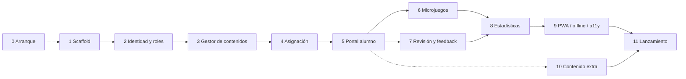

# Englove — Desarrollo etapa por etapa (PBP Development)

> **Propósito.** Plan de construcción del piloto en etapas secuenciales, con objetivo, alcance, entregables, criterios de salida, dependencias, riesgos y tamaño de cada una. Sigue el orden de construcción **Decidido** en `.agents/CONTEXT.md` §12, la arquitectura de [`architecture-overview.md`](./architecture-overview.md) y la metodología SDD de [`sdd-process.md`](./sdd-process.md). Las tareas concretas y su estado están en [`taskboard.md`](./taskboard.md).
>
> **Terminología.** _Fase_ = horizonte de producto (Piloto, Fase 2 Academia, Fase 3 SaaS; CONTEXT §2). _Etapa_ = bloque de construcción dentro del piloto. Las etapas se numeran igual que CONTEXT §12 para mantener trazabilidad; la Etapa 0 agrupa lo que debe ocurrir antes o en paralelo al primer código.
>
> Estados: **Decidido**, **Propuesto**, **Pendiente**, como en CONTEXT.
>
> Última actualización: 2026-09-21. Incorpora las decisiones 20–30 de CONTEXT §14: SDD, acceso por correo y contraseña, escala 0,0–5,0, nuevo intento habilitado por la profesora, retención de audios, hosting Vercel + Render, navegación 2–4 clics y estadísticas de rendimiento y constancia.

---

## Índice

1. Principios de ejecución
2. Mapa de etapas e hitos
3. Definición de Hecho
4. Etapas del piloto (0 a 11)
5. Observaciones al orden decidido
6. Después del piloto: Fase 2 y Fase 3
7. Riesgos transversales

---

## 1. Principios de ejecución

1. **La profesora entra primero** (Decidido, CONTEXT §2.1). Recibe acceso al panel en staging al cerrar la Etapa 3, no al final. Cada semana que carga contenido antes del lanzamiento es una semana ganada.
2. **Cortes verticales.** Cada etapa entrega algo usable de punta a punta (API + interfaz + prueba), no una capa técnica aislada.
3. **Nada de CONTEXT §2.4.** Si una etapa parece necesitarlo, se para y se propone en CONTEXT §14.
4. **Las pruebas E2E se escriben al cerrar el flujo que cubren** (Etapas 4, 5 y 7), no todas al final. En la Etapa 11 solo se ejecuta la suite completa.
5. **Los pendientes de CONTEXT §15 no bloquean el arranque.** Cada etapa indica qué decisión necesita y qué se hace mientras no llega.
6. **Toda tarea cumple la Definición de Hecho** (§3) antes de moverse a Hecho en el taskboard.
7. **Spec antes que código (SDD, Decidido, CONTEXT §11.1).** Cada etapa empieza con la redacción y aprobación de su spec (`SPEC-NN`), que se escribe durante la etapa anterior. Ninguna tarea `ENG` pasa a "En curso" sin su spec Aprobada. Proceso completo en [`sdd-process.md`](./sdd-process.md).

---

## 2. Mapa de etapas e hitos

### 2.1 Secuencia y paralelismo

Las líneas discontinuas indican trabajo que puede ejecutarse en paralelo con la etapa a la que apuntan. Las Etapas 6 y 7 comparten dependencia (la 5) y pueden solaparse si hay más de una persona.

Ritmo SDD: mientras se implementa la etapa N, se redacta la spec de la etapa N+1 (calendario en `sdd-process.md` §7). La redacción de una spec cabe en el tamaño estimado de la etapa anterior; no se suma al total.

### 2.2 Tamaño estimado — Propuesto

Supuesto: una persona full-stack senior a tiempo completo. Con dos personas, las Etapas 6 y 7 se solapan y el total baja entre 2 y 3 semanas. Son rangos orientativos para ordenar expectativas, no compromisos.

| Etapa | Nombre                       | Tamaño | Semanas                    |
| ----- | ---------------------------- | ------ | -------------------------- |
| 0     | Arranque                     | M      | 1–2, en paralelo con 1 y 2 |
| 1     | Scaffold                     | S      | 1                          |
| 2     | Identidad y roles            | M      | 2                          |
| 3     | Gestor de contenidos         | XL     | 3–4                        |
| 4     | Asignación                   | S      | 0.5–1                      |
| 5     | Portal del estudiante        | XL     | 3–4                        |
| 6     | Microjuegos                  | L      | 2–3                        |
| 7     | Calificación, feedback y nuevo intento | M | 1.5–2                   |
| 8     | Estadísticas y leaderboard   | M      | 1–1.5                      |
| 9     | PWA, offline y accesibilidad | M      | 1.5–2                      |
| 10    | Contenido extra              | S      | 0.5                        |
| 11    | Lanzamiento                  | M      | 1–2                        |
|       | **Total**                    |        | **12–13 semanas (3 meses)** |

La redacción de specs (SDD) no añade semanas: se hace en paralelo con la etapa anterior y su coste ya está dentro de estos rangos.

### 2.3 Hitos

| Hito                                        | Significado                                                             | Se alcanza al cerrar |
| ------------------------------------------- | ----------------------------------------------------------------------- | -------------------- |
| **H1 — La profesora puede crear contenido** | Recibe acceso al panel en staging y empieza a cargar actividades reales | Etapa 3              |
| **H2 — Un alumno completa una actividad**   | El ciclo Activity → Assignment → Attempt funciona de punta a punta      | Etapa 5              |
| **H3 — Ciclo pedagógico completo**          | Grabar → calificar → recibir feedback, el corazón del producto          | Etapa 7              |
| **H4 — Listo para el piloto**               | Condiciones de CONTEXT §12.11 cumplidas; decisión go/no-go              | Etapa 11             |

---

## 3. Definición de Hecho

Una tarea o etapa está Hecha cuando:

- [ ] La spec que cubre la tarea estaba **Aprobada** antes de empezar a implementar, y la tarea implementa solo lo que la spec pide. Si apareció algo no cubierto, quedó anotado en la spec (preguntas abiertas o registro de cambios).
- [ ] El PR enlaza la spec y los requisitos (RF) que cubre.
- [ ] El código está revisado por otra persona (o, si el equipo es una sola persona, autorevisado con la checklist de PR) y fusionado en `main`.
- [ ] Tiene pruebas del nivel que le corresponde, nombradas por el RF que verifican: unitarias para lógica (scorers, conversión a 0,0–5,0, reglas de insignias), integración para guards y consultas, E2E si cierra uno de los tres flujos de CONTEXT §11.
- [ ] Las migraciones de Prisma están en el repositorio y pasaron por CI contra staging. Nunca `db push`.
- [ ] Toda consulta a datos de tenant filtra por `organization_id`.
- [ ] Ningún puntaje ni calificación se acepta desde el cliente; toda calificación está en la escala 0,0–5,0.
- [ ] No construye nada de CONTEXT §2.4.
- [ ] Interfaz en español, identificadores en inglés.
- [ ] Si cerró un pendiente de CONTEXT §15 o cambió una decisión de §14, CONTEXT se actualizó en el mismo cambio.
- [ ] El taskboard refleja el nuevo estado y, si era la última tarea de una spec, la spec pasó a Implementada (y a Verificada cuando sus pruebas pasan en CI).

---

## 4. Etapas del piloto

### Etapa 0 — Arranque

**Objetivo.** Dejar listas las decisiones, cuentas y materiales que no son código pero condicionan todo lo demás. Corre en paralelo con las Etapas 1 y 2; sus elementos tienen fechas límite distintas.

**Alcance.**

- Repositorio git con remoto. El directorio de trabajo hoy no es un repositorio.
- Arranque de SDD: carpeta `specs/` con plantilla e índice (SPEC-00) y redacción de SPEC-01 (Scaffold). Son las primeras specs del proyecto; hasta aquí no se ha redactado ninguna.
- Cuentas en Vercel y Render (hosting Decidido, CONTEXT §6) con proyectos de staging y producción apuntando al repositorio; dominio provisional con `app.` y `api.`.
- Proyectos Supabase de staging y producción; buckets privados.
- Documentos legales: autorización parental en papel (Ley 1581 de 2012), T&C del acudiente, política de privacidad redactada para padres.
- Especificación de tokens de diseño (dos conjuntos, Kids y Teens) y prototipo navegable del portal del alumno con la navegación de 2–4 clics por zona (architecture §3.1).
- Sesiones de observación con 3 niños reales por segmento (CONTEXT §8).

Cerrado antes de esta versión (2026-09-21): hosting, UX de acceso del alumno, retención de audios, política de reintentos y métrica del piloto. Ya no forman parte de la etapa.

**Entregables.** Repositorio, cuentas (Supabase, Vercel, Render), `specs/` con plantilla y SPEC-01 Aprobada, borradores legales revisados, especificación de tokens, informe de la observación con niños.

**Criterios de salida escalonados.**

- Antes de la Etapa 1: repositorio, cuentas de Supabase, SPEC-01 Aprobada.
- Antes de la Etapa 2: dominio reservado y proyectos de Vercel y Render creados; SPEC-02 Aprobada (se redacta durante la Etapa 1).
- Antes de la Etapa 5: tokens especificados y observación con niños realizada.
- Antes de la Etapa 11: documentos legales listos y consentimientos en recogida.

**Dependencias.** Ninguna técnica. Depende de una revisión legal y de la disponibilidad de niños para la observación.

**Riesgos.** La observación con niños no ocurre: el tema Kids se diseña a ciegas; mitigación: hacerla con hijos de conocidos aunque sea informal. Tentación de saltarse SPEC-01 por parecer "solo infraestructura": la spec del scaffold fija el esquema núcleo y las convenciones que todas las demás heredan; no se salta.

**Tamaño.** M, 1–2 semanas de trabajo repartidas en el calendario.

**Tareas.** SPEC-00, SPEC-01, ENG-001, ENG-003, ENG-004, ENG-006, ENG-007, ENG-008. (ENG-002, ENG-005 y ENG-009 quedaron Hechas por decisión el 2026-09-21.)

---

### Etapa 1 — Scaffold (CONTEXT §12.1)

**Objetivo.** Monorepo funcionando con web, API, paquete compartido, esquema núcleo y CI que ejecuta migraciones.

**Alcance.**

- pnpm + Turborepo con `apps/web`, `apps/api`, `packages/shared` y `tooling`.
- Next.js con App Router, TypeScript estricto, Tailwind, shadcn/ui y grupos de rutas vacíos.
- NestJS con configuración validada, `health`, Swagger automático y logging pino.
- `schema.prisma` con todas las entidades de CONTEXT §7.2 aunque muchas no se usen aún (incluidas `PasswordResetToken`, los campos de bloqueo en `User` y los de nuevo intento en `Attempt`), enums, `organization_id`, índices; migración inicial; seed con la organización piloto y la usuaria profesora.
- `packages/shared` con enums, tipos del contrato de actividad y registro de esquemas Zod vacío.
- CI: lint, typecheck, tests, `prisma migrate deploy` en staging y un check que prohíbe `db push`. Despliegue automático de staging en Vercel y Render desde `main`.
- Docker compose con Postgres 16, `.env.example` y README de arranque.
- Test de esquema: toda tabla de tenant tiene `organization_id`.
- Tabla `FeatureFlag` con servicio en la API y carga en el frontend al iniciar sesión; configuración inicial `passing_score`, `retention_days`, `pending_upload_ttl_days`.
- Cuenta de correo transaccional (Resend, Decidido) con dominio verificado y `MailService` con plantillas de registro y recuperación, lista para la Etapa 2.
- Redacción de SPEC-02 (Identidad y sesión) en paralelo.

**Fuera de alcance.** Cualquier pantalla funcional.

**Entregables.** `pnpm dev` levanta web y API en local; `/health` y `/docs` responden; CI verde con la migración inicial aplicada en staging; `/health` responde en `api-staging.<dominio>` y la web vacía carga en `app-staging.<dominio>`.

**Criterios de salida.**

- Un desarrollador nuevo arranca el proyecto siguiendo el README en menos de 30 minutos.
- El esquema completo existe y migró en staging.
- El check de `db push` falla si se introduce en un script.
- SPEC-02 Aprobada.

**Dependencias.** SPEC-01 Aprobada, ENG-001 (repositorio), ENG-004 (Supabase), ENG-003 (dominio) para el despliegue de staging.

**Riesgos.** Sobreingeniería del scaffold. Mitigación: nada que no se use en la Etapa 2 o 3. Instancia gratuita de Render que se duerme: aceptable en staging; en producción se contrata instancia siempre activa antes del piloto (architecture §11.3).

**Tamaño.** S, 1 semana.

**Tareas.** ENG-010 a ENG-019, SPEC-02.

---

### Etapa 2 — Identidad y roles (CONTEXT §12.2)

**Objetivo.** El alumno puede auto-registrarse y la profesora puede iniciar sesión; la API aplica RBAC, aislamiento de tenant y el bloqueo de cuentas `pending_approval` en cada petición; existen `Organization`, `Guardian` y `Student`.

**Alcance.**

- Login único con correo y contraseña para todos los roles (Decidido, CONTEXT §4): argon2id, cookies `httpOnly`, refresh rotativo (30 días profesora, 90 días alumno), detección de reutilización y logout.
- **Auto-registro del estudiante (Decidido, CONTEXT §4.1, decisión 33):** `POST /auth/signup` y pantalla `/registro`; crea `User` + `Guardian` + `Student` en `pending_approval`; el login de una cuenta `pending_approval` o `rejected` no entra aunque la contraseña sea correcta.
- Alta directa por la profesora como flujo alterno (`POST /students` con `approval_status = approved` desde el inicio), para alumnos sin correo propio.
- Bloqueo de cuenta tras 10 intentos fallidos durante 10 minutos (Decidido), visible para la profesora en el panel con desbloqueo anticipado de alumnos.
- Correos de cuenta con el mismo proveedor y remitente: solicitud recibida, cuenta aprobada, bienvenida del alta directa (enlace para fijar la contraseña, 72 h) y recuperación de contraseña (enlace de un solo uso de 30 minutos, revocación de sesiones); contraseña temporal generada por la profesora con cambio obligatorio como alternativa.
- Guards `JwtAuthGuard`, `RolesGuard`, `TenantContext` y extensión de Prisma para el filtro de tenant.
- CRUD de `Guardian` (con versión y fecha de T&C) y de `Student` (con `User` asociado con correo obligatorio, nivel, segmento y `consent_status`).
- Pantallas de login, registro, recuperación y restablecimiento de contraseña; redirección por rol.
- Endurecimiento HTTP: helmet, CORS con allowlist, throttler (incluye límite estricto en `signup`), comprobación de `Origin`.
- Pruebas de integración de auth, auto-registro, bloqueo, recuperación y aislamiento de tenant.
- Redacción de SPEC-03 en paralelo (incluye la bandeja de solicitudes de registro).

**Fuera de alcance.** Pantallas de `parent` y `admin`; el enum existe (Decidido). Aprobación o rechazo de solicitudes desde el panel (necesita grupos, Etapa 3; aquí solo se construye la API `requests`/`approve`/`reject` sin interfaz). Acceso por código de aula, PIN o avatar: descartado (decisión 22).

**Entregables.** Un alumno se registra en `/registro` y su cuenta queda pendiente; la profesora entra y ve un panel vacío; un intento de login del alumno pendiente es rechazado con `ACCOUNT_PENDING_APPROVAL`; un alumno recupera su contraseña desde el correo en staging; una petición con JWT de otra organización recibe 403 o resultados vacíos.

**Criterios de salida.**

- Test que demuestra que un refresh reutilizado revoca la familia de sesión.
- Test que demuestra que un `student` recibe 403 en un endpoint de `teacher`.
- Test de aislamiento de tenant sobre al menos dos modelos.
- Test: el décimo intento fallido bloquea la cuenta 10 minutos y el login correcto tras el bloqueo pone el contador a cero.
- Test: un token de recuperación usado o caducado es rechazado; el restablecimiento revoca las sesiones abiertas.
- Test: `POST /auth/signup` crea la cuenta en `pending_approval` y el login subsecuente es rechazado con `ACCOUNT_PENDING_APPROVAL` hasta que `approval_status` cambie a `approved`.
- Test: el correo de solicitud recibida y el de recuperación salen del mismo remitente.
- SPEC-03 Aprobada.

**Dependencias.** SPEC-02 Aprobada. Etapa 1. ENG-019 (correo transaccional) para la recuperación en staging.

**Riesgos.** Cookies entre `app.` y `api.` mal configuradas en Vercel o Render. Mitigación: probar el login en staging en la primera semana; plan B con rewrite de Next (architecture §8.2). Alumnos pequeños sin correo propio: la profesora crea la cuenta con el correo que indique el acudiente y entrega la contraseña temporal en persona.

**Tamaño.** M, 2 semanas.

**Tareas.** ENG-020 a ENG-028, SPEC-03.

---

### Etapa 3 — Gestor de contenidos (CONTEXT §12.3) → Hito H1

**Objetivo.** La profesora crea actividades de los cinco tipos por nivel MCER y gestiona la bandeja de solicitudes de registro, alumnos, acudientes, grupos y estado de consentimiento. Es la etapa más grande y la que decide si el piloto tendrá contenido.

**Alcance.**

- Esquemas Zod completos por tipo con separación `config` / `answerKey`: `fill_blank`, `open_question`, `speaking`, `game` con cinco mecánicas, `exam`.
- Tablas de detalle 1:1 y migración.
- Endpoints `activities`: CRUD, estados `draft` / `published` / `archived`, duplicar, versionado por duplicación.
- Panel: layout, navegación, lista de actividades con filtros por nivel y tipo.
- Formularios: fill in the blanks (editor de oraciones con huecos y opciones), pregunta abierta, speaking, microjuegos (uno por mecánica, derivados del esquema Zod), examen (composición de ítems).
- CRUD de grupos y membresías.
- **Bandeja de solicitudes de registro (Decidido, CONTEXT §4.1, decisión 33):** interfaz sobre `GET /students/requests`, `POST /students/:id/approve` y `POST /students/:id/reject`, con asignación de nivel y grupo al aprobar. Es la vía principal de alta.
- Gestión de alumnos y acudientes (alta directa como flujo alterno con correo de acceso, restablecer contraseña, ver y levantar bloqueos); `ConsentRecord` en papel con estado visible en la lista de alumnos, independiente de la aprobación de la cuenta.
- Sesión cronometrada de onboarding: la profesora crea su primera actividad en menos de 10 minutos (CONTEXT §5.1).
- Redacción de SPEC-04 y SPEC-05 en paralelo.

**Fuera de alcance.** Vista previa con el renderizador del alumno (llega en la Etapa 5; hasta entonces, resumen textual de la actividad). Educaplay embebido.

**Entregables.** Panel en staging con acceso para la profesora. Actividades reales cargadas por ella. Al menos una solicitud de auto-registro aprobada de punta a punta en staging.

**Criterios de salida.**

- Los cinco tipos se crean, editan, publican y archivan desde el panel.
- Una actividad publicada con intentos no se puede editar en sitio; solo duplicar o archivar (test).
- La profesora creó una actividad de cada tipo sin ayuda en la sesión cronometrada, y la primera en menos de 10 minutos. Si no se cumple, se itera el formulario antes de seguir. No es negociable: CONTEXT dice que el piloto fracasa por falta de contenido antes que por bugs.
- Todo alumno dado de alta (por auto-registro aprobado o alta directa) tiene acudiente, correo de acceso único y estado de consentimiento.
- Aprobar una solicitud activa la cuenta y el alumno puede iniciar sesión de inmediato con la contraseña que fijó en el registro (test).
- Rechazar una solicitud borra la cuenta sin dejar filas huérfanas (test).
- SPEC-04 Aprobada; SPEC-05 al menos En revisión.

**Dependencias.** SPEC-03 Aprobada. Etapa 2.

**Riesgos.** Formularios de microjuego demasiado abstractos para la profesora; mitigación: plantillas de ejemplo por mecánica y texto de ayuda en cada campo. El editor de huecos es el componente más complejo de la etapa; mitigación: empezar con una sintaxis simple en texto (`[correcta|distractor|distractor]`) y sumar un editor visual solo si la profesora lo pide.

**Tamaño.** XL, 3–4 semanas.

**Tareas.** ENG-030 a ENG-044, SPEC-04, SPEC-05.

---

### Etapa 4 — Asignación (CONTEXT §12.4)

**Objetivo.** La profesora asigna una actividad publicada a uno o varios grupos con fecha de apertura y de cierre.

**Alcance.**

- Modelo y endpoints `assignments` con `opens_at` y `due_at`. Regla de un intento por asignación (Decidido, decisión 25); la habilitación de un nuevo intento llega en la Etapa 7.
- Interfaz de asignación y vista por grupo; fechas en zona America/Bogota.
- Validaciones: solo actividades `published`; `opens_at < due_at`; no duplicar una asignación activa del mismo par actividad-grupo.
- E2E flujo 1: la profesora crea y asigna una actividad.
- Cierre de SPEC-05 en paralelo.

**Entregables.** Asignaciones creadas y visibles por grupo. Primer test E2E en CI.

**Criterios de salida.**

- El E2E del flujo 1 pasa en CI contra staging.
- Un borrador no se puede asignar (test).
- SPEC-05 Aprobada.

**Dependencias.** SPEC-04 Aprobada. Etapa 3.

**Riesgos.** Bajo. La etapa es pequeña; el riesgo es dejarla incompleta por parecer obvia.

**Tamaño.** S, 0.5–1 semana.

**Tareas.** ENG-050 a ENG-053.

---

### Etapa 5 — Portal del estudiante (CONTEXT §12.5) → Hito H2

**Objetivo.** Un alumno entra, ve sus asignaciones abiertas, completa fichas de Classroom (fill in the blanks, pregunta abierta, speaking) y ve su progreso personal.

**Alcance.**

- Layout del alumno con tokens por `age_segment`; navegación de 2 a 4 clics según la zona (architecture §3.1): actividades a 2, resto hasta 3–4.
- Home con asignaciones abiertas ordenadas por `due_at`.
- Ciclo de intento en la API: start con `attemptToken` (rechaza un segundo intento sin habilitación), eventos por lotes idempotentes, complete; estados y `flags`.
- Runtime del contrato en el cliente: `ActivityRenderer` y `useAttempt`.
- `ScoringService` con conversión de fracción de acierto a la escala 0,0–5,0 y umbral de aprobación configurable.
- Fill in the blanks: renderizador, scorer en servidor y corrección por ítem en `complete`.
- Pregunta abierta → `pending_review`.
- Módulo `media`: URLs firmadas, `MediaAsset`, verificación de derechos, límites de tamaño.
- Speaking: `MediaRecorder`, blob en IndexedDB, subida firmada, confirmación en `complete`.
- `ProgressEvent`, motor de insignias con `BadgeRule` y rachas semanales perdonables; seed de reglas iniciales (primera tarea, primer audio, 4/8/12 semanas, 5 años).
- Vista de progreso personal: estrellas, insignias, rachas.
- Borrado en cascada de alumno, con el test escrito antes.
- Texto a voz en consignas Kids; objetivos táctiles grandes.
- Vista previa de actividad en el panel reutilizando el renderizador (cierra ENG-039, nacida en la Etapa 3).
- E2E flujo 2: el alumno completa una actividad.
- Redacción de SPEC-06 y SPEC-07 en paralelo.

**Fuera de alcance.** Microjuegos (Etapa 6). Feedback de la profesora y nuevo intento (Etapa 7). Cola offline completa (Etapa 9): en esta etapa el blob de audio ya se persiste localmente, pero el reintento automático llega después.

**Entregables.** Portal usable en tablet con los dos temas. Segundo E2E en CI.

**Criterios de salida.**

- Un alumno Kids y uno Teens ven temas distintos con los mismos componentes (verificación visual y test de `data-theme`).
- El scorer de fill in the blanks tiene pruebas unitarias con casos límite: respuesta vacía, ítem faltante, duplicados; la conversión a 0,0–5,0 tiene pruebas de redondeo y de rango.
- Cada zona del portal respeta su techo de clics (revisión contra la tabla de architecture §3.1 en la spec).
- Un segundo `POST /assignments/:id/attempts` del mismo alumno responde `ATTEMPT_ALREADY_EXISTS` (test).
- Un audio grabado con la red cortada a mitad de subida no se pierde: queda en IndexedDB y se puede reintentar manualmente.
- El test de borrado en cascada pasa y no deja objetos en el bucket.
- El E2E del flujo 2 pasa en CI.
- SPEC-06 y SPEC-07 Aprobadas.

**Dependencias.** SPEC-05 Aprobada. Etapa 4. ENG-007 y ENG-008 (tokens y observación con niños) de la Etapa 0.

**Riesgos.** `MediaRecorder` en iOS Safari tiene formatos y permisos distintos; mitigación: probar en un iPhone o iPad real en la primera semana de la etapa. Los niños no entienden la navegación; mitigación: la observación con niños de la Etapa 0 debe haber ocurrido; si no, hacerla con el primer build de esta etapa.

**Tamaño.** XL, 3–4 semanas.

**Tareas.** ENG-060 a ENG-072, ENG-039, SPEC-06, SPEC-07.

---

### Etapa 6 — Microjuegos (CONTEXT §12.6)

**Objetivo.** Cinco mecánicas en React puro detrás del contrato de actividad, con puntaje en servidor y validación de duración.

**Alcance.**

- Emparejar, ordenar palabras, arrastrar y soltar (dnd-kit), memoria de tarjetas, elección múltiple con temporizador.
- Scorers de servidor por mecánica, con fórmula de fracción de acierto definida en el esquema de cada mecánica y salida en 0,0–5,0; validación de duraciones plausibles.
- Sonido (Howler) y confeti por tema; carga diferida de los bundles de animación Kids y Teens.
- Zona "Juegos" en el portal, a 3 clics del juego (architecture §3.1).
- Redacción de SPEC-08 en paralelo.

**Fuera de alcance.** Phaser (Fase 2). Mecánicas adicionales.

**Entregables.** Cinco juegos jugables en tablet, configurables desde el panel, calificados en servidor en la escala 0,0–5,0.

**Criterios de salida.**

- Cada mecánica implementa `ActivityRuntimeProps` sin llamar a la API directamente (revisión de código y regla de lint que prohíbe importar el cliente HTTP desde `activities/`).
- El bundle inicial del portal no incluye las animaciones del tema inactivo (verificación con el analizador de bundle).
- Un intento con duración implausible queda marcado con `flags` y visible para la profesora.
- Prueba táctil de las cinco mecánicas en una tablet Android real.
- SPEC-08 Aprobada.

**Dependencias.** SPEC-06 Aprobada. Etapa 5 (runtime del contrato). Puede solaparse con la Etapa 7 si hay dos personas.

**Riesgos.** Arrastrar y soltar en pantallas táctiles pequeñas; mitigación: dnd-kit con sensores táctiles y objetivos de al menos 48 px; probar en el dispositivo real desde el primer día.

**Tamaño.** L, 2–3 semanas.

**Tareas.** ENG-080 a ENG-087, SPEC-08.

---

### Etapa 7 — Calificación, feedback y nuevo intento (CONTEXT §12.7) → Hito H3

**Objetivo.** La profesora califica audios y respuestas abiertas en la escala 0,0–5,0 con comentario personal y stickers, decide si un estudiante puede hacer un nuevo intento, y el alumno recibe el feedback. Cierra el ciclo pedagógico.

**Alcance.**

- Endpoint de cola (`pending_review`) y de calificados (incluidos los autocalificados) con filtros por grupo, tipo y fecha; polling de 30 s en el panel.
- Interfaz de calificación y feedback con dos pestañas: reproducir audio con URL firmada, leer respuesta, calificar 0,0–5,0, comentar, stickers, y el campo **"Habilitar nuevo intento"** (Decidido, decisión 25).
- `Review` actualiza el intento, emite `ProgressEvent(review_received)` y fija `retention_until` del audio (`graded_at + retention_days`).
- Endpoint `grant-retry` para intentos ya calificados, con `extendUntil` opcional; el alumno ve la habilitación en su home y el nuevo intento enlaza al anterior.
- Job nocturno de retención de audios: borrado de calificados vencidos y de subidas no confirmadas (architecture §4.5). Nace en la Etapa 11 y se adelanta aquí porque la política ya está decidida.
- Vista de feedback en el portal del alumno, por actividad y agregada en `/feedback` (3–4 clics).
- E2E flujo 3: la profesora califica y el alumno ve el feedback.
- Redacción de SPEC-08 (si no se cerró en la 6) en paralelo.

**Entregables.** Área de calificación operativa; feedback visible para el alumno; nuevo intento funcionando de punta a punta; audios calificados se borran al vencer el plazo en staging. Tercer E2E en CI.

**Criterios de salida.**

- Cada intento calificado manualmente tiene un comentario (Decidido: feedback personal por intento; el campo es obligatorio, los stickers son opcionales).
- Una calificación fuera de 0,0–5,0 es rechazada (test).
- Habilitar un nuevo intento permite exactamente un intento más; un segundo `grant-retry` sin usar el anterior es rechazado; las estadísticas usan el último intento calificado (tests).
- Una URL firmada de audio caduca a los 5 minutos (test).
- Un alumno no puede pedir la URL del audio de otro alumno (test).
- El job de retención borra el objeto del bucket y conserva `Review` y `Attempt.score` (test de integración con reloj simulado).
- El E2E del flujo 3 pasa en CI.

**Dependencias.** SPEC-07 Aprobada. Etapa 5. Independiente de la Etapa 6.

**Riesgos.** Reproducción de WebM/Opus en Safari de escritorio; mitigación: recomendar Chrome o Edge a la profesora y documentarlo. Confusión entre "comentar un intento automático" y "habilitar nuevo intento"; mitigación: el campo de habilitación es un interruptor explícito con texto de confirmación.

**Tamaño.** M, 1.5–2 semanas.

**Tareas.** ENG-090 a ENG-096 (incluye las antiguas ENG-133 y ENG-134, renumeradas).

---

### Etapa 8 — Estadísticas y leaderboard (CONTEXT §12.8)

**Objetivo.** Panel estadístico centrado en **rendimiento y constancia por estudiante** (Decidido, CONTEXT §13), con polling de 30 s y leaderboard privado para la profesora.

**Alcance.**

- Consultas agregadas: serie de calificaciones por alumno, promedios por tipo, nivel y grupo, semanas activas y rachas, finalización de lo asignado, tiempo por actividad con recorte de valores implausibles; agregados diario, semanal y mensual; índices; regla del último intento calificado.
- Vista por estudiante (línea de tiempo de rendimiento + calendario de constancia), vista por grupo (tabla de ambos ejes) y vista general, según architecture §9.4.
- Panel con polling.
- Leaderboard solo para `teacher`, con test de 403 para alumnos.
- Redacción de SPEC-09 en paralelo.

**Entregables.** Panel estadístico funcional con las tres vistas; leaderboard privado.

**Criterios de salida.**

- Ninguna consulta de estadísticas supera 500 ms con datos de prueba de 100 alumnos y 3 meses de intentos (script de seed de volumen).
- Un `student` recibe 403 en el leaderboard (test).
- La profesora, en sesión de validación en staging, identifica sin ayuda para un alumno concreto si mejora o empeora y si entra con constancia. Si no lo consigue, se iteran las vistas antes de cerrar la etapa.
- SPEC-09 Aprobada.

**Dependencias.** SPEC-08 Aprobada. Etapas 6 y 7 (datos de todos los tipos).

**Riesgos.** Gráficas bonitas que no responden a "¿cómo va este alumno?". Mitigación: cada gráfica de la spec se justifica con una pregunta concreta de la profesora; lo que no responde a una pregunta no se construye.

**Tamaño.** M, 1–1.5 semanas.

**Tareas.** ENG-100 a ENG-103, SPEC-09.

---

### Etapa 9 — PWA, offline y accesibilidad (CONTEXT §12.9)

**Objetivo.** El portal se instala como PWA, tolera conexión débil sin perder trabajo y pasa un control de accesibilidad.

**Alcance.**

- Manifest, iconos, service worker (Serwist), instalación.
- Cola offline en IndexedDB para eventos y audios con reintento automático al reconectar y al abrir la app.
- Pase de accesibilidad: contraste AA en ambos temas (axe en CI), foco, tamaños táctiles, texto a voz.
- Prueba de rendimiento en una tablet Android real de gama media o baja.

**Entregables.** PWA instalable; pruebas de red cortada documentadas; informe de accesibilidad y rendimiento.

**Criterios de salida.**

- Escenario probado: el alumno completa una ficha en modo avión y las respuestas llegan al servidor al reconectar, sin duplicados (test con `clientEventId`).
- Escenario probado: un audio grabado sin red se sube solo al recuperar la conexión.
- axe no reporta violaciones de contraste en las pantallas del alumno.
- El portal carga y los juegos responden en la tablet de control sin bloqueos perceptibles.

**Dependencias.** SPEC-09 Aprobada. Etapas 5 y 6.

**Riesgos.** Service worker que cachea respuestas autenticadas de otro usuario en un dispositivo compartido; mitigación: estrategia `NetworkFirst` para la API y limpieza de caché en logout.

**Tamaño.** M, 1.5–2 semanas.

**Tareas.** ENG-110 a ENG-113, SPEC-10.

---

### Etapa 10 — Contenido extra (CONTEXT §12.10)

**Objetivo.** La profesora publica enlaces externos (Educaplay u otros) y el alumno los abre fuera del flujo de calificación.

**Alcance.** CRUD de `ExternalResource` en API y panel; sección en el portal con enlaces que abren en pestaña nueva. Sin iframe (Decidido).

**Entregables.** Sección visible en ambos lados, controlada por el flag `extra_content`.

**Criterios de salida.** Ningún enlace se embebe; ningún recurso genera `Attempt` ni `ProgressEvent`.

**Dependencias.** SPEC-10 Aprobada. Etapa 5. Puede hacerse en cualquier hueco posterior.

**Tamaño.** S, 0.5 semanas.

**Tareas.** ENG-120 y ENG-121.

---

### Etapa 11 — Lanzamiento del piloto (CONTEXT §12.11) → Hito H4

**Objetivo.** Cumplir las condiciones previas de CONTEXT §12.11 y decidir go/no-go.

**Alcance.**

- Suite E2E completa (tres flujos) ejecutándose en CI contra staging.
- Captura de errores de frontend con rol y versión, con alertas al equipo.
- Verificación del plan de backups de Supabase y ensayo de restauración en staging.
- Producción en Vercel y Render con dominio propio, instancia de Render siempre activa, correo transaccional con dominio real verificado.
- Contenido inicial cargado por la profesora: checklist por nivel A1–B2 con un mínimo acordado de actividades por nivel y tipo.
- Consentimientos en papel recogidos y registrados para el 100 % de los alumnos activos.
- Cuentas de alumnos creadas con su correo de acceso y contraseña temporal entregada.
- Checklist de lanzamiento y reunión go/no-go.
- Todas las specs SPEC-01 a SPEC-10 en estado Verificada.

**Entregables.** Producción desplegada; checklist firmada.

**Criterios de salida** (condiciones de CONTEXT §12.11).

- Consentimientos: cero alumnos activos en estado `pending`.
- Contenido cargado según la checklist.
- Estadísticas de rendimiento y constancia operativas y validadas por la profesora (Etapa 8).
- Restauración de backup ensayada con éxito al menos una vez.
- Los tres E2E verdes en la versión que se despliega.
- Captura de errores recibiendo eventos de producción.
- Ninguna spec en estado distinto de Verificada u Obsoleta.

**Dependencias.** Todas las anteriores.

**Riesgos.** Alumnos que no consiguen entrar el primer día por contraseñas olvidadas; mitigación: la profesora tiene el restablecimiento con contraseña temporal a un clic y la lista de bloqueados visible. Nombre definitivo del producto sin decidir: se lanza con "Englove" como provisional (CONTEXT §15).

**Tamaño.** M, 1–2 semanas, más el tiempo de carga de contenido de la profesora, que empieza en H1.

**Tareas.** ENG-130 a ENG-132, ENG-135 a ENG-139.

---

## 5. Observaciones al orden decidido

El orden de CONTEXT §12 es Decidido y este documento lo respeta. Las siguientes observaciones quedan para que el equipo las evalúe; si se aceptan, se registran en CONTEXT §14.

1. **Intercambiar las Etapas 6 y 7.** Se propuso adelantar la calificación y el feedback (7) antes que los microjuegos (6) para acercar el Hito H3. **Rechazada el 2026-09-21 (CONTEXT §14, decisión 31):** el orden de CONTEXT §12 se mantiene, microjuegos primero. Consecuencia: H3 llega tras la Etapa 7 según el calendario de §2.2; si hay dos personas, ambas etapas pueden solaparse porque dependen solo de la 5.
2. **Acceso de la profesora en H1, no al final.** Ya está reflejado en la Etapa 3 y es consecuencia directa de la Decisión 8 de CONTEXT. Se menciona para que nadie lo posponga con el argumento de que "no está terminado".
3. **E2E por flujo, no al final.** Reflejado en las Etapas 4, 5 y 7. No contradice §12; §11 pide los tres E2E y no dice cuándo.
4. **Feature flags y test de `organization_id` en la Etapa 1.** Ambos son baratos y evitan retrabajo; encajan en el "schema núcleo" de §12.1.
5. **Vista previa de actividad (ENG-039)** se entrega en la Etapa 5 aunque nace en la 3, porque reutiliza el renderizador del alumno. Construirla antes duplicaría código.

---

## 6. Después del piloto: Fase 2 y Fase 3

Solo horizonte, sin plan detallado. Se planifica cuando el piloto lo justifique.

### 6.1 Compuerta hacia Fase 2

- La profesora confirma, con las estadísticas de rendimiento y constancia, que sus alumnos usan la plataforma de forma sostenida y avanzan; el periodo de observación se acuerda con ella al lanzar.
- Al menos una academia o un segundo profesor con intención real de uso.
- Deuda del piloto saldada: nombre definitivo del producto.

### 6.2 Fase 2 — Academia (CONTEXT §2.2)

Bloques en orden orientativo:

1. Multi-tenant real: segunda `Organization`, onboarding de profesores, rol `admin` con pantallas.
2. Consentimiento digital con evidencia (timestamp, versión del documento, IP); registro autónomo del acudiente.
3. Rol `parent` con pantallas: progreso de sus hijos.
4. Muro privado de actividades presenciales: fotos sin metadatos EXIF, URLs firmadas, acceso solo a acudientes del grupo, autorización de uso de imagen.
5. Phaser detrás del contrato de actividad, sin cambios en API ni panel.
6. Capacitor, cumplimiento de los programas infantiles de las tiendas, publicación.

### 6.3 Fase 3 — SaaS (CONTEXT §2.3)

1. `Organization` y `Subscription` activas; pasarela de pagos (Wompi o ePayco para Colombia; Stripe si hay expansión internacional).
2. Rango de edad 5–18: nuevo segmento o ajuste de tokens.
3. Catálogo ampliado de minijuegos.

---

## 7. Riesgos transversales

| Riesgo                              | Señal temprana                                                  | Mitigación                                                                                                   |
| ----------------------------------- | --------------------------------------------------------------- | ------------------------------------------------------------------------------------------------------------ |
| Falta de contenido al lanzar        | La profesora no ha creado actividades dos semanas después de H1 | Sesión de onboarding cronometrada (ENG-043); iterar formularios antes de seguir; acordar un mínimo por nivel |
| Código sin spec ("luego la escribo") | Un PR sin enlace a spec; una prueba sin RF                       | La plantilla de PR y la Definición de Hecho lo exigen; el revisor devuelve el PR                             |
| Specs que se escriben todas al inicio | SPEC-05 redactada antes de terminar la Etapa 2                 | Calendario de sdd-process §7: una etapa por delante                                                          |
| Cookies entre Vercel y Render       | Las cookies no llegan a la API en staging                       | Dominio propio en ambas capas (architecture §8.2); probar en la Etapa 2; plan B con rewrite de Next          |
| Formatos de audio entre navegadores | La profesora no puede reproducir un audio                       | Probar Chrome, Edge y Safari en la Etapa 5; recomendar navegador; transcodificación en Fase 2                |
| Niños abandonan por fricción        | Bajada de semanas activas tras la primera semana                | Observación con niños en la Etapa 0; 2–4 clics según zona; sesión de 90 días; captura de errores activa      |
| Alumnos que olvidan la contraseña   | Bloqueos frecuentes en el panel; alumnos que dejan de entrar    | Contraseña temporal por la profesora a un clic; recuperación por correo; frases memorables en Kids           |
| Abuso del auto-registro (endpoint público) | Solicitudes falsas o repetidas en la bandeja de la profesora | Throttling estricto en `signup` (architecture §8.3); rechazo borra en cascada sin dejar rastro; la profesora nunca aprueba sin verificar al acudiente |
| Scope creep hacia CONTEXT §2.4      | Aparece una tarea de WebSockets, Phaser, pagos o muro           | Detener y proponer en CONTEXT §14; el taskboard no admite tareas de §2.4                                     |
| Una sola persona en el equipo       | Las Etapas 6 y 7 no se solapan; total 17–24 semanas             | Aceptar el calendario (el intercambio de etapas fue rechazado, decisión 31) o sumar una segunda persona en la Etapa 6 |
