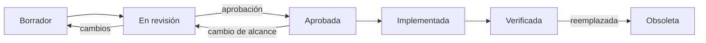

# Englove — Proceso de desarrollo: Spec-Driven Development (SDD)

> **Propósito.** Definir cómo se construye Englove día a día: qué es una especificación, dónde vive, quién la aprueba, cómo se relaciona con el código, las pruebas y el taskboard. Es **Decidido** (CONTEXT §14, decisión 21). Desarrolla la metodología; no contiene ninguna especificación. La redacción de las specs empieza cuando arranque la Etapa 1 y sigue el calendario de §7.
>
> Documentos hermanos: [`architecture-overview.md`](./architecture-overview.md) (cómo está construida la plataforma), [`pbp-development.md`](./pbp-development.md) (etapas), [`taskboard.md`](./taskboard.md) (tareas y estado). La fuente de verdad de producto es `.agents/CONTEXT.md`.
>
> Última actualización: 2026-09-21.

---

## Índice

1. Qué significa SDD en Englove
2. Jerarquía de documentos
3. Qué es una spec y qué no
4. Estructura de la carpeta `specs/`
5. Plantilla de especificación
6. Ciclo de vida de una spec
7. Calendario de redacción
8. Relación con el taskboard, las pruebas y el código
9. Reglas para agentes y personas
10. Anti-patrones

---

## 1. Qué significa SDD en Englove

**La especificación se escribe, se revisa y se aprueba antes de escribir código.** El código implementa la spec; las pruebas verifican la spec; el taskboard rastrea la spec. Si el código y la spec discrepan, se corrige la spec primero (si el cambio es deseado) o el código (si no lo es). Nunca se deja la discrepancia sin resolver.

Por qué SDD para este proyecto:

- **Equipo pequeño y agentes de IA.** Una spec aprobada es el contrato que permite delegar implementación a una persona o a un agente sin releer conversaciones. Es la misma razón por la que existe `CONTEXT.md`.
- **Producto con reglas de negocio precisas** (puntaje en servidor, aislamiento por tenant, privacidad de menores, escala 0,0–5,0). Son reglas fáciles de romper en silencio; la spec las hace verificables.
- **La profesora entra en H1.** Cada etapa entrega algo real a una usuaria real. La spec fija qué se entrega y evita que la etapa crezca sola.

Lo que SDD **no** significa aquí: no es documentación exhaustiva, no es diseño en cascada, no es una spec por cada tarea del taskboard. Una spec cubre una **capacidad** completa (por ejemplo, "identidad y sesión", "ciclo de intento y puntaje") y se escribe justo antes de la etapa que la construye.

---

## 2. Jerarquía de documentos

```
.agents/CONTEXT.md            ← qué se construye y por qué. Decisiones de producto.
planning/architecture-overview.md ← cómo está construida la plataforma. Decisiones técnicas.
planning/sdd-process.md       ← este documento. Cómo se trabaja.
planning/pbp-development.md   ← en qué orden. Etapas e hitos.
planning/taskboard.md         ← qué está hecho, en curso, bloqueado.
specs/                        ← contratos detallados por capacidad. Se derivan de todo lo anterior.
código y pruebas              ← implementan y verifican las specs.
```

Regla de conflicto: manda el documento de arriba. Una spec no puede contradecir `CONTEXT.md` ni `architecture-overview.md`; si necesita hacerlo, primero se propone el cambio en CONTEXT §14 o en architecture §14, y la spec se escribe después.

---

## 3. Qué es una spec y qué no

Una spec **es**:

- Un documento Markdown en `specs/`, con identificador `SPEC-NN`, que describe una capacidad de punta a punta: comportamiento observable, contrato de API, cambios de datos, interfaz, seguridad y criterios de aceptación verificables.
- Escrita en español, con identificadores técnicos en inglés (CONTEXT §16).
- Lo bastante concreta para que dos implementaciones independientes produzcan el mismo comportamiento observable.
- Lo bastante corta para leerse en menos de 20 minutos. Si se pasa, se divide.

Una spec **no es**:

- Un diseño de clases ni un listado de archivos. Eso lo decide quien implementa, dentro de las convenciones de architecture §13.
- Un mockup de alta fidelidad. La sección de interfaz describe pantallas, estados y flujos; el diseño visual vive en los tokens y en el prototipo (ENG-007, ENG-008).
- Una repetición de CONTEXT o architecture. La spec enlaza a la sección correspondiente y solo añade lo que falta para implementar.

---

## 4. Estructura de la carpeta `specs/`

```
specs/
├── README.md                     # índice: SPEC-NN, título, estado, etapa, tareas que cubre
├── _template.md                  # plantilla de §5
├── SPEC-01-scaffold.md
├── SPEC-02-identidad-y-sesion.md
├── SPEC-03-gestor-de-contenidos.md
├── SPEC-04-asignacion.md
├── SPEC-05-portal-e-intentos.md
├── SPEC-06-microjuegos.md
├── SPEC-07-revision-y-feedback.md
├── SPEC-08-estadisticas.md
├── SPEC-09-pwa-offline-a11y.md
└── SPEC-10-contenido-extra.md
```

- La numeración sigue las etapas de `pbp-development.md`. Si una etapa necesita más de una spec, se usa un sufijo: `SPEC-05a`, `SPEC-05b`.
- El `README.md` de `specs/` es el único índice. Se actualiza en el mismo cambio que crea o cambia de estado una spec.
- Los nombres de archivo van en kebab-case y en español, como el resto de la documentación.

---

## 5. Plantilla de especificación

Todas las secciones son obligatorias. Si una no aplica, se escribe "No aplica" y por qué; no se elimina.

```markdown
# SPEC-NN — <Título de la capacidad>

| Campo | Valor |
|---|---|
| Estado | Borrador / En revisión / Aprobada / Implementada / Verificada / Obsoleta |
| Etapa | N — <nombre> |
| Tareas | ENG-xxx, ENG-yyy |
| Referencias | CONTEXT §a, §b · architecture §c, §d |
| Aprobada por / fecha | — |

## 1. Contexto y objetivo
Qué problema resuelve esta capacidad y para quién. Dos o tres párrafos.

## 2. Alcance
- Incluye: …
- No incluye (y dónde se cubre): …

## 3. Requisitos funcionales
Lista numerada RF-1, RF-2… Cada requisito lleva al menos un criterio de aceptación en formato
**Dado** <estado inicial> **Cuando** <acción> **Entonces** <resultado observable>.
Los criterios son la fuente directa de las pruebas.

## 4. Reglas de negocio
Reglas que cruzan varios requisitos: límites, cálculos, estados y transiciones, umbrales.
Aquí viven, por ejemplo, la escala 0,0–5,0, el bloqueo por intentos fallidos o la racha perdonable.

## 5. Contrato de API
Por endpoint: método, ruta, roles autorizados, cuerpo de entrada, respuesta, códigos de error
(`code` estable según architecture §13). Se enlaza al esquema Zod de `packages/shared` cuando exista.

## 6. Modelo de datos
Tablas y columnas nuevas o modificadas, enums, índices, migración. Alineado con architecture §6.

## 7. Interfaz
Pantallas, estados (vacío, cargando, error, éxito), navegación y número de clics desde la home,
diferencias Kids / Teens si las hay, textos clave en español.

## 8. Seguridad y privacidad
Qué guard aplica, qué filtra por `organization_id`, qué datos de menores se tocan, qué no se registra en logs.

## 9. Pruebas
Qué pruebas unitarias, de integración y E2E verifican esta spec, mapeadas a los RF.
Qué se prueba en dispositivo real, si aplica.

## 10. Fuera de alcance y decisiones diferidas
Qué se dejó fuera a propósito y en qué spec o fase se retomará.

## 11. Preguntas abiertas
Lista con responsable y fecha. Una spec no pasa a Aprobada con preguntas abiertas que bloqueen un RF.

## 12. Registro de cambios
| Fecha | Cambio | Motivo |
```

---

## 6. Ciclo de vida de una spec



| Estado | Significado | Quién lo cambia |
|---|---|---|
| **Borrador** | Se está escribiendo. Puede tener huecos y preguntas abiertas. | Quien redacta |
| **En revisión** | Completa según la plantilla. Se revisa contra CONTEXT y architecture. | Quien redacta la propone; el líder del proyecto revisa |
| **Aprobada** | Contrato vinculante. A partir de aquí se puede escribir código. | Líder del proyecto |
| **Implementada** | Todas las tareas ENG que cubre están en Hecho en el taskboard. | Quien cierra la última tarea |
| **Verificada** | Las pruebas de §9 pasan en CI y, si aplica, la profesora validó la capacidad en staging. | Quien ejecuta la verificación |
| **Obsoleta** | Reemplazada por otra spec. Se conserva por trazabilidad con enlace a la que la sustituye. | Quien crea la sustituta |

Reglas de transición:

- **Nadie escribe código de producción contra una spec que no esté Aprobada.** Se permite un prototipo desechable para responder una pregunta abierta, y se declara como tal.
- **Cambiar una spec Aprobada** exige volver a "En revisión" con una fila en el registro de cambios. Si el cambio es menor (redacción, un código de error), basta con anotar el cambio y mantener Aprobada.
- **Una spec Implementada que no pasa a Verificada** en la misma etapa bloquea el hito correspondiente.

---

## 7. Calendario de redacción

Las specs se escriben **una etapa por delante** de la implementación, no todas al principio. Así incorporan lo aprendido en la etapa anterior sin frenar el arranque.

| Spec | Se redacta durante | Debe estar Aprobada antes de |
|---|---|---|
| Plantilla e índice de `specs/` | Etapa 0 | Etapa 1 |
| SPEC-01 Scaffold | Etapa 0 | Etapa 1 |
| SPEC-02 Identidad y sesión | Etapa 1 | Etapa 2 |
| SPEC-03 Gestor de contenidos | Etapa 2 | Etapa 3 |
| SPEC-04 Asignación | Etapa 3 | Etapa 4 |
| SPEC-05 Portal e intentos | Etapa 3–4 | Etapa 5 |
| SPEC-06 Microjuegos | Etapa 5 | Etapa 6 |
| SPEC-07 Revisión y feedback | Etapa 5 | Etapa 7 |
| SPEC-08 Estadísticas | Etapa 6–7 | Etapa 8 |
| SPEC-09 PWA, offline y accesibilidad | Etapa 8 | Etapa 9 |
| SPEC-10 Contenido extra | Cualquier hueco | Etapa 10 |

Hoy (2026-09-21) **no se redacta ninguna spec**. La primera, SPEC-01, se escribe al iniciar la Etapa 0 (tareas SPEC-00 y SPEC-01 del taskboard).

---

## 8. Relación con el taskboard, las pruebas y el código

**Taskboard.**

- Cada etapa del taskboard empieza con una tarea `SPEC-NN` que consiste en redactar y aprobar la spec de la etapa. Es dependencia de todas las tareas `ENG` de esa etapa.
- Cada tarea `ENG` referencia la spec que implementa y, cuando aplica, el RF concreto. Una tarea `ENG` sin spec aprobada no puede pasar a "En curso".
- Al cerrar la última tarea `ENG` de una spec, la spec pasa a Implementada; al pasar sus pruebas en CI, a Verificada.

**Pruebas.**

- Los criterios de aceptación (Dado / Cuando / Entonces) se convierten en pruebas con nombre trazable: `RF-3: rechaza un score enviado por el cliente`.
- Los tres flujos E2E de CONTEXT §11 están cubiertos por SPEC-04, SPEC-05 y SPEC-07, y se escriben al cerrar esas etapas (pbp §1.4).
- Una prueba que no corresponde a ningún RF es una señal: o falta un RF en la spec o la prueba sobra.

**Código.**

- Los pull requests enlazan la spec y los RF que cubren. La plantilla de PR (ENG-001) tiene un campo obligatorio para ello.
- La Definición de Hecho (pbp §3) exige spec Aprobada y RF cubiertos por pruebas.
- Los esquemas Zod de `packages/shared` y `schema.prisma` se derivan de las secciones 5 y 6 de la spec. Cuando el código existe, es la referencia autoritativa del *detalle*; la spec sigue siendo la referencia del *comportamiento*.

---

## 9. Reglas para agentes y personas

1. Antes de implementar una tarea, leer en este orden: la spec correspondiente, las secciones de CONTEXT y architecture que enlaza, y la tarea en el taskboard. No empezar por el código.
2. Si la spec no cubre un caso que aparece al implementar, **detenerse y anotarlo en §11 de la spec** (preguntas abiertas). Si el caso es menor y la respuesta es obvia por CONTEXT o architecture, resolverlo y registrarlo en el registro de cambios de la spec. Si no, escalar al líder del proyecto.
3. No inventar comportamiento "razonable" que la spec no pide. Lo no especificado no se construye.
4. Al terminar, actualizar en el mismo cambio: estado de la tarea en el taskboard, estado de la spec si corresponde, y CONTEXT §14/§15 si se cerró un pendiente o cambió una decisión.
5. Toda spec respeta lo Decidido en CONTEXT (§16). Si una spec necesita cambiar una decisión, la ruta es CONTEXT §14 primero.
6. Las specs se escriben para que las lea la próxima persona o agente sin contexto previo. Enlaces en vez de repeticiones; ejemplos concretos en vez de adjetivos.

---

## 10. Anti-patrones

| Anti-patrón | Por qué es un problema | Qué hacer |
|---|---|---|
| Escribir todas las specs antes de la Etapa 1 | Se vuelven obsoletas antes de implementarse | Una etapa por delante (§7) |
| Una spec por tarea del taskboard | Fragmenta el comportamiento; nadie ve la capacidad completa | Una spec por capacidad; tareas enlazan RF |
| Spec sin criterios Dado/Cuando/Entonces | No se puede verificar; las pruebas se improvisan | Cada RF con al menos un criterio |
| Cambiar el código y "luego actualizo la spec" | La spec deja de ser fuente de verdad en horas | Spec primero, aunque sea una fila en el registro de cambios |
| Copiar secciones de CONTEXT en la spec | Dos fuentes que divergen | Enlazar la sección |
| Spec Aprobada con preguntas abiertas bloqueantes | El implementador decide por su cuenta | Resolver o recortar alcance antes de aprobar |
| Implementar algo de CONTEXT §2.4 porque "la spec lo insinúa" | Rompe una decisión firme | Detenerse; proponer en CONTEXT §14 |
